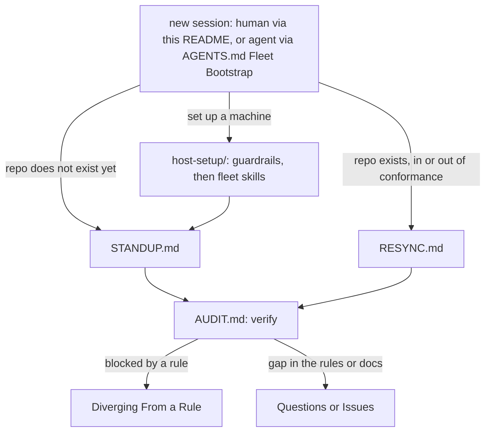

# ProjectTemplate <!-- omit from toc -->

Agent enablement for a fleet of repositories: autonomy and repeatable quality inside guardrails.

## Build and Distribution <!-- omit from toc -->

- **Source Code**: [GitHub][github-link] for source, issues, discussions, and CI/CD pipelines.
- **Versioned Releases**: [GitHub Releases][releases-link] for version-tagged source archives.

### Build Status <!-- omit from toc -->

[![Releases Build][releases-build-shield]][actions-link]\
[![Last Commit][last-commit-shield]][commits-link]

### Releases <!-- omit from toc -->

[![GitHub Release][github-release-shield]][releases-link]\
[![GitHub Pre-Release][github-pre-release-shield]][releases-link]

### Release Notes <!-- omit from toc -->

**Version**: 2.0

**Summary**:

- Agent enablement for the fleet: shared rules, a machine-readable spec, a fleet registry, per-repo audit reports, and an audit-agent instruction set, so an agent works autonomously inside guardrails that prove the result. Ships no application code.

See [Release History][history] for the full history.

## Getting Started <!-- omit from toc -->

This repo has two kinds of reader, a human and an AI coding agent, and they enter at different doors. **An agent starts at [AGENTS.md][agents]**, which maps a task to the document that governs it and is written to be read one section at a time. **A human starts here**, and the table below is the fork: find the row that describes why you opened this page, and read the one it points at rather than the whole file.

| You are | Your question | Start at |
| --- | --- | --- |
| Browsing GitHub | What is this, and why does it exist? | [What This Repo Is][what-this-repo-is] and [What It Achieves][what-it-achieves] |
| Setting up a machine where an agent runs | How do I deploy the host guardrails? | [`docs/host-setup.md`][host-setup] |
| Adopting the rules in a repository | How do I stand a repo up? | [`STANDUP.md`][standup], then [`AUDIT.md`][audit] |
| Keeping a repository in line | It is stood up already. How do I bring it up to the current rules? | [`RESYNC.md`][resync] |
| Blocked by a rule | How do I diverge from one, or grant a write the guard denies? | [Diverging From a Rule][diverging-from-a-rule] |
| Reporting a defect or proposing a rule | Where does that go, and what does it need? | [Questions or Issues][questions-or-issues] |
| An AI coding agent | Which document governs the task in front of me? | [`AGENTS.md`][agents] |

Nothing here is installed as a dependency. The rules are read, the baseline is carried into a repository as files it then owns, and the one thing that is genuinely installed is the host guardrail kit, which lands in your home directory rather than in any repository.

## Table of Contents <!-- omit from toc -->

- [What This Repo Is](#what-this-repo-is)
- [What It Achieves](#what-it-achieves)
- [How This Repo Operates](#how-this-repo-operates)
- [Using This Repo](#using-this-repo)
  - [Deploy the Host Guardrails](#deploy-the-host-guardrails)
  - [Install the Fleet Skills](#install-the-fleet-skills)
  - [Carry the Rules Into a Repository](#carry-the-rules-into-a-repository)
  - [Adopting Outside This Fleet](#adopting-outside-this-fleet)
- [Diverging From a Rule](#diverging-from-a-rule)
  - [A Repository Diverging From a Carried Unit](#a-repository-diverging-from-a-carried-unit)
  - [A Write the Host Guard Denies](#a-write-the-host-guard-denies)
- [Rules](#rules)
  - [Always](#always)
  - [Never](#never)
  - [If a C# Project](#if-a-c-project)
  - [If a Python Project](#if-a-python-project)
  - [If Both C# and Python](#if-both-c-and-python)
  - [If Publishing a Package (NuGet or PyPI)](#if-publishing-a-package-nuget-or-pypi)
  - [If a Docker Image](#if-a-docker-image)
  - [For a README or Human-Facing Doc](#for-a-readme-or-human-facing-doc)
  - [For Workflows](#for-workflows)
- [Questions or Issues](#questions-or-issues)
- [Development Environment Setup](#development-environment-setup)
- [3rd Party Tools](#3rd-party-tools)
- [License](#license)

## What This Repo Is

**The purpose is agent enablement.** An AI coding agent is fast and inconsistent, so a fleet built by one drifts a different way in every repository, and the drift stays invisible until something breaks where it matters. What this repo makes repeatable is the outcome: an agent stands a repository up, changes it, and releases it on its own, and lands in the same known-good shape every time. The guardrails are what make granting that autonomy sound rather than reckless.

**Guardrails here enable rather than restrain.** A rule earns its place by removing a decision an agent would otherwise make differently every time, or by making a failure loud that would otherwise pass green. Write safety bounds what an agent can reach outside the project in front of it, the review loop closes before anything merges, and the audit proves the result instead of accepting the agent's report of it. Autonomy extends exactly as far as the verification reaches.

**Nothing here is finished.** Every rule traces to a specific failure, nearly all of them observed in this fleet rather than imagined, and a procedure that lets a new one through is corrected as part of the work that found it. The ground truth improves by being used.

This repo is the single home for those rules, a machine-readable spec they are checked against, a registry of the projects, and an audit-agent instruction set. It ships no application code. Each project owns its own implementation and is **audited** against the ground truth here, to the letter (exact file, section, or config) or to intent (an equivalent outcome).

- **[AGENTS.md][agents]** - the agent entry point: context and delegation rules, plus the map from a task to the section that governs it.
- **[GOVERNANCE.md][governance]** - cross-cutting rules for AI coding agents: git, branching, release model, doc style, the recurring-violation rules (comments, ASCII charset, US spelling, line endings), PR review etiquette, and workflow YAML conventions.
- **[CODESTYLE.md][codestyle]** - code style for .NET and Python.
- **[WORKFLOW.md][workflow]** - the CI/CD workflow contract (behavioral guarantees D1-D9) and its audit methodology.
- **[STANDUP.md][standup]** - how an agent stands a repository up and carries the baseline it is owed.
- **[AUDIT.md][audit]** - how an agent audits a repository against the spec and reports drift.
- **[RESYNC.md][resync]** - how an agent brings an already-stood-up repository back into line, in the order the remedies require.
- **[spec/][spec]** - the machine-readable ground truth: project-type requirements, the file/section baseline, required/forbidden secrets, the host tool contract and its version floors, and the preferred README structure.
- **[registry/repos.json][repos]** - the fleet registry: every project, its type(s), publish mechanism, and status (cataloged or standardization backlog).
- **[repo-config/][repo-config]** - hub-only branch rulesets, fleet settings, the apply script, and the GitHub setup reference (kept out of `.github/`, which is Actions-owned).
- **[host-setup/][host-setup-dir]** - the host guardrail kit, which is per machine rather than per repository.
- **[catalog/][catalog]** - reusable reference snippets (workflow tasks, config exemplars, devcontainers) the audit compares implementations against.
- **[reports/][reports]** - per-repo audit output.
- **[docs/][docs]** - the human setup and reference guides: host prerequisites, SSH signing, devcontainers, and the carry procedures.

**The words a request is phrased in are defined here.** A repository is asked to audit itself against the hub, or to close the review loop on a pull request, and the phrasing carries the whole instruction, so each term below names the file that answers it and a request using one is a complete instruction rather than a starting point for interpretation.

- **The hub** - this repository. It is the single authority on what a fleet project is supposed to hold, and every rule naming the hub means this one.
- **The fleet** - the projects listed in [registry/repos.json][repos], each audited downward against the ground truth here rather than negotiating its own.
- **Stand a repository up** - carry the baseline a project is owed for its declared types and workflow model, per [STANDUP.md][standup]. An absent file is a baseline that never arrived rather than drift.
- **Audit a repository** - read a live project against the spec and report its drift, per [AUDIT.md][audit]. The audit never edits what it measures, so a fix is a separate change.
- **Resync a repository** - bring an already-stood-up project up to the current hub, per [RESYNC.md][resync]. It audits for the findings and then applies them in order, which includes deleting what the hub hosts rather than carries.
- **Close the review loop** - request a review on every push, confirm it covered the head commit, triage every finding, reply and resolve, and escalate when stuck, per [GOVERNANCE.md "PR Review Etiquette"][governance-pr-review-etiquette].
- **Carried against reached** - a project carries the content it is audited against and reaches the machinery that is identical everywhere, per [GOVERNANCE.md "Hub-Hosted Tooling"][governance-hub-hosted-tooling].

## What It Achieves

Keeping a fleet of repositories consistent has always been a tax paid in review attention, and it stops scaling at the point where one person can no longer hold every repo in their head. An agent changes that arithmetic in both directions at once. It can apply a convention across every repository in an afternoon, and it can spread a mistake exactly as fast. What makes the speed worth having is a ground truth an agent can read, a gate that proves the result rather than reporting it, and a boundary naming the decisions that are never the agent's to make. Each objective below is a standing capability, with the machinery that delivers it named so the claim is checkable.

- **Workflow consistency, by contract rather than by copy.** Every repo satisfies one behavioral CI/CD contract ([WORKFLOW.md][workflow], guarantees D1 to D9) instead of inheriting one YAML file it then edits. The fixed part is the orchestration seam, meaning job names, the ruleset-bound required check, and the artifact handoff. What a repo builds inside that seam is its own, so a Hugo site and a NuGet package satisfy the same contract without pretending to be the same pipeline.
- **Technical consistency that does not depend on anyone remembering it.** One line-ending policy, one comment shape, one character set, one US-English convention, and one config per linter shared by the editor, the CLI, and CI. A rule that holds in review therefore holds on a laptop and in the pipeline, because all three read the same file rather than three copies that drift apart.
- **Best practices promoted once, not re-litigated per repo.** A practice that proves itself becomes fleet law in [GOVERNANCE.md][governance] or [CODESTYLE.md][codestyle] and is carried, rather than being rediscovered and re-argued in the next repository. Every rule here traces to a specific failure that actually happened, which is why the collection is opinionated and small rather than exhaustive.
- **Feedback loops that close on the procedure, not the instance.** [AUDIT.md][audit] reads a live repo and reports drift, the per-repo reports in [reports/][reports] record it, and a repo that cannot be stood up from the docs alone is a documentation defect tracked in the [conformance matrix][matrix]. When a downstream agent hits something the procedure did not cover, the fix lands in the procedure so the next repo never meets it.
- **Onboarding a new language or deployment target is a spec change.** Thirteen project types are declared today in [spec/project-types.json][project-types]. Adding one means declaring its detection, its checks, and the files it carries, then proving a context-free agent can stand it up cold. No fleet-wide rewrite, and no per-repo improvisation.
- **Re-deployment that is measured and traceable.** Versions come from git history through NBGV rather than a hand-edited number, a release is always a deliberate act and never a side effect of a merge, and staleness is detected by **content hash against the hub's own past revisions**, so the audit can say whether a repo is behind the canonical or has forked it. A version stamp is a claim a repo can keep while editing the content underneath, so it is never trusted for that answer.
- **Every carried unit declares how much freedom it grants.** This is the distinction that makes the whole thing tolerable to work in, and it is a field on each [spec/files.json][files] entry rather than something a reader infers from the file's shape. An entry that names no level takes `presence`, the most permissive one, so silence grants freedom rather than withholding it:

  | Level | The obligation | Who owns the content |
  | --- | --- | --- |
  | `verbatim` | Byte-identical to canonical, after governed normalization | The hub. A paraphrase is a defect, not an adaptation. |
  | `interface` | Honor a named contract, checked by name and wiring | The repo owns the body entirely. |
  | `intent` | Reach the same outcome, judged by meaning | The repo owns the wording and shape. |
  | `presence` | The unit exists | The repo owns all of it. |

- **The human contributes where domain expertise is decisive, and only there.** The maintainer keeps what an agent cannot know or must not decide: creating a repository, granting a write outside the owner boundary, changing a ruleset, approving every merge, and every judgment about the domain a repo actually serves. The agent takes the mechanical scale-out, which is the part that does not benefit from human attention and degrades under it. A repo's own knowledge also has a declared destination rather than an improvised one, chosen by what the content is: `CODESTYLE.md` for conventions beyond the carried rules, `ARCHITECTURE.md` for how a code repo is built, `OPERATIONS.md` for how a live-service repo is run, and `TODO.md` for its backlog. Which of those a repo carries follows from what it is, so this hub holds the two that apply to it. Domain expertise therefore lands somewhere declared instead of being diluted into a carried file that the next re-vendor overwrites.

## How This Repo Operates

ProjectTemplate follows the same model it documents, and audits its own rules against itself (it classifies as the source-only project type in [WORKFLOW.md][workflow]).

The doors a session enters through, and where each leads, matching the "Getting Started" table above:



The full entry-point map behind these doors, with the gap register and the roadmap that closes it, is [docs/fleet-map.md][fleet-map].

Within this repo, day-to-day development follows the same branching, CI, review, and release model it documents for the fleet:

- **Branching.** Persistent `main` and `develop`, each with its own ruleset. This repo uses the default `release` workflow model: commit on feature branches only, feature branch to `develop` is squash-merged, `develop` to `main` is a merge commit, and `develop` is forward-only (no `main -> develop` back-merges). Live-service config repos instead use the `operational` model (registry `workflowModel`), with direct signed commits to `develop`, promoted to `main` by an occasional PR. See [GOVERNANCE.md "Branching Model"][governance-branching-model].
- **CI is lint-only.** There is no build or unit test. The PR gate runs markdownlint, cspell, JSON validation (`jq` parses `registry/`, `spec/`, and `repo-config/`, plus the `spec/validate.py` cross-reference and shape checks), and actionlint, and exposes the ruleset-bound `Check pull request workflow status job` aggregator. The same lint configs (`.markdownlint-cli2.jsonc`, `cspell.json`) drive the editor extensions, the CLI, and CI.
- **Review loop.** Every PR is reviewed by GitHub Copilot, and the agent drives the review loop to green and merges only with explicit maintainer permission. See [GOVERNANCE.md "PR Review Etiquette"][governance-pr-review-etiquette].
- **Release.** A `develop -> main` merge is promoted through a GitHub release (tag plus a source zip, README, and LICENSE). Versioning is NBGV-driven from [version.json][version]. See [WORKFLOW.md][workflow].

## Using This Repo

Four things are deployed from here, and they land in different places. The host guardrails install once per machine, the fleet skills install once per user on that machine, the baseline is carried once per repository, and the audit is run whenever a repository changes materially. Do them in that order on a new machine, because the guardrails bound every session that follows and retrofitting them means the sessions in between ran unguarded.

### Deploy the Host Guardrails

The guardrails are the one component that is installed rather than read, and they are **host state rather than repository content**, because they have to cover ad-hoc sessions in no project at all. They deny a mis-targeted GitHub write under your identity, and a git operation that would only land by bypassing a branch rule.

```shell
host-setup/agent-safety/install.sh        # Linux, WSL, macOS
```

```powershell
.\host-setup\agent-safety\install.ps1     # Windows, and the .\ prefix is required
```

Restart Claude Code sessions on the machine afterward so the hook and the `CLAUDE.md` blocks load. The installer is idempotent, so re-running it is also how a machine picks up an upstream change to the guard. What it installs, how to verify it, and what it deliberately does not catch are in [`host-setup/agent-safety/README.md`][agent-safety], and the surrounding host prerequisites (git identity, SSH signing, `gh`, `docker`, `uv`) are in [`docs/host-setup.md`][host-setup].

### Install the Fleet Skills

The skills are the per-topic rules packaged so they surface in an agent session by trigger, instead of being re-read from the law docs each time. They install once per user per machine, from a hub checkout, and land beside the guardrails rather than in any repository:

```shell
python3 scripts/skills_install.py            # or the scripts/skills_install.sh / .ps1 wrapper
python3 scripts/skills_install.py --report   # read-only: is this machine current?
```

A host stood up end to end by the [`host-setup/`][host-setup-dir] bootstrap gets this step at the end of its host mode, so a fresh machine finishes with the tools, the identity, and the skills together. [`docs/host-setup.md`][host-setup] "Fleet Skills Install" carries the details, including how the install degrades where the `claude` CLI is absent.

### Carry the Rules Into a Repository

A repository that does not exist yet is stood up with [`STANDUP.md`][standup], which is ordered rather than a menu: verify commit identity and signing before the first commit, hand the maintainer what only they can supply, classify the repo and write its [registry][repos] entry, carry the instruction set before authoring anything of your own, then carry the remaining baseline, the workflows, and the settings. The two steps with a closing window are first, because signing has to be live before the first commit and the rules have to be loaded before the first authored file.

A repository that already exists is measured with [`AUDIT.md`][audit] instead. The audit is read-only and ends in a report under [reports/][reports], so nothing is changed by measuring, and applying what it found is a separate reviewable change per its section 10. Onboarding is complete when the repo passes, or carries a committed report plus a tracking issue for the residual deltas, per [GOVERNANCE.md "Repository Onboarding and Conformance"][governance-repository-onboarding-and-conformance].

A repository that is stood up already and has fallen behind is resynced with [`RESYNC.md`][resync], which is the third entry point and the one a request to sync a repository with the hub resolves to. It runs the audit for the findings and then applies them in an order that matters: the rules first, because they govern what comes after them, then the deletions, because a re-vendor would otherwise refresh a file that is about to go, then the re-vendors, the workflow contracts, and the repository configuration. It also states what the measurement cannot see, since a carried file at `intent` fidelity is checked for presence alone and a hub revision inside one raises no finding at all.

The mechanical helpers that go with those procedures are documented beside them: [`docs/repo-config.md`][repo-config-doc] for branch rulesets and repository settings, and [`docs/content-import.md`][content-import] for importing existing content into a new repo.

### Adopting Outside This Fleet

The rules, the spec, and the procedures are readable and reusable by anyone, and the guardrail kit installs on any host. What does not transfer is the registry, since [registry/repos.json][repos] lists this fleet's projects, and standing a repository up writes an entry in it. Adopting outside this fleet therefore means running your own hub, forked or copied, holding your own registry and your own reports, with `AGENTS.md`, `GOVERNANCE.md`, `CODESTYLE.md`, `WORKFLOW.md`, and `spec/` adapted to what your projects actually are. There is no supported mode where an outside repository points at this hub's registry.

## Diverging From a Rule

A rule that cannot be diverged from is a rule people work around silently, which is worse than the divergence, so both kinds of exception have a declared channel. The two kinds are genuinely different: one is a repository not matching a carried unit, and the other is a host guard denying a write. Neither is granted by editing the thing that blocked you.

### A Repository Diverging From a Carried Unit

**Check the unit's fidelity level first, because most apparent divergences are not divergences at all.** Each [spec/files.json][files] entry declares one of `verbatim`, `interface`, `intent`, or `presence`, defaulting to `presence`, and the two permissive levels already hand the repo its content outright. A repo rewriting a `presence` or `intent` file to suit itself is exercising the freedom the level grants rather than breaking a rule, and the audit asserts nothing beyond presence for it. See [spec/fidelity-model.md][fidelity-model] for which unit sits where and why.

**A divergence from a `verbatim` or `interface` unit is recorded, not hidden.** The ledger is [spec/divergences.json][divergences], where each entry names the path, the repos, a disposition, and a reason, and `spec/fidelity_honesty.py --report` joins it against live fleet reality to regenerate [reports/divergences.md][divergences-report]. A divergence recorded as `accepted` is a legitimate permanent one and no further action is owed. A live divergence with no entry renders as `UNTRIAGED`, which is the point: the audit does not care whether a difference is deliberate, only whether someone decided about it. Edit the ledger and regenerate the report, never the report.

**A rule that is wrong for many repositories is a hub defect rather than a per-repo exception.** [AUDIT.md][audit] section 9 says so directly, that a repeated letter miss many repos share is a signal the spec needs adjusting, so raise it here instead of accumulating one exception per repository.

### A Write the Host Guard Denies

The guard denies a `gh` write whose explicit target sits under an owner other than the checkout's `origin` owner, which is the shape that once put a stray comment on a stranger's repository. Sibling repositories under the same owner are allowed, so the denial appears only on a write that leaves the owner, and the common case that raises it is a fork, where `origin` is yours and `upstream` is the project you forked from.

The only way past it is a grant the maintainer makes **outside the session**, in `GH_WRITE_GUARD_ALLOW`. It is deliberately not something an agent can do for itself once blocked, so an inline `GH_WRITE_GUARD_ALLOW=owner/repo gh ...` prefix and an `export` inside a shell call both leave the write denied. The worked example, the file the grant goes in, and how to confirm one took effect are in [`docs/host-setup.md` "Granting a Write the Guard Denies"][host-setup-granting-a-write-the-guard-denies].

## Rules

A human-readable index of the rules agents enforce, implement, and audit. The authority for each is [GOVERNANCE.md][governance], [CODESTYLE.md][codestyle], and [WORKFLOW.md][workflow]. The machine-checkable form lives in [spec/][spec].

### Always

- Sign every commit (SSH or GPG).
- Branch feature -> develop (squash) -> main (merge commit), and develop is forward-only.
- Drive every PR through the Copilot review loop and merge only with maintainer approval.
- Write US English and ASCII only (no em-dash, straight quotes).
- Write docs and comments in the present tense, describing only the current state, never as a change from a prior one.
- Keep comments concise and only for the non-obvious, and never grow them on edit.
- Follow `.editorconfig` line endings (LF default, CRLF for `.bat`/`.cmd`) and preserve a file's endings on edit.
- One logical paragraph per line, with a trailing `\` for an intentional hard break.
- Pin every GitHub Action to a commit SHA with a version comment.
- Share one lint config per tool across the editor, the CLI, and CI.
- Run the repo's whole lint gate before pushing, not just the parts that look relevant.
- Make gates fail loud, since a gate that stops gating must error or annotate, never pass silently.
- Favor VS Code tasks and launch configs for building, running, and testing over ad-hoc shell scripts.

### Never

- Never force-push or rewrite shared history.
- Never treat a merge as a release. Publishing is a separate, explicit step.
- Never blanket-delete a workflow run's artifacts.
- Never store a static key when OIDC Trusted Publishing is available.

### If a C# Project

- Carry the shared `[*.cs]` block in `.editorconfig` and build with zero warnings.

### If a Python Project

- Configure ruff and a type checker in `pyproject.toml`, either pyright strict or mypy in CI with pyright editor-only. Whichever runs in CI is the gate.

### If Both C# and Python

- Both sections above apply, and a repo can be both (a C# app plus a Python subtree). The Python is either a full uv project (`uv.lock`, `uv run`) or a stdlib-only `uvx` scripts subtree (no `uv.lock`, `pyproject.toml` carries lint/type config only). See [CODESTYLE.md][codestyle] "Two profiles".

### If Publishing a Package (NuGet or PyPI)

- Publish via OIDC Trusted Publishing, never a stored API key.

### If a Docker Image

- Cache layers to a registry tag (never `type=gha`) and publish the size-limited Docker Hub README separately.

### For a README or Human-Facing Doc

- Follow the section order in [spec/readme-structure.md][readme-structure] and put every URI as a grouped, alphabetized reference link at the bottom.

### For Workflows

- Make GitHub Actions satisfy the [WORKFLOW.md][workflow] contract (guarantees D1-D9), which the audit verifies.

## Questions or Issues

File everything at [Issues][issues-link], including a defect in a rule, a procedure that did not survive contact with a real repository, and a proposal for a new rule. Use [Discussions][discussions-link] for an open question that is not yet a defect. This repo ships no application code, so an issue here is about the rules, the spec, the procedures, or the tooling under [`scripts/`][scripts] and [`spec/`][spec], never about a downstream project's behavior, which belongs on that project's own tracker.

An issue is most useful when it names the ground truth it disagrees with, so include the file and section that states the rule, the repository and branch where the problem was observed, and what you expected instead. A finding measured against a specific commit is worth more than one measured against a memory of the docs, per [GOVERNANCE.md "Verification Discipline"][governance-verification-discipline].

Two kinds of report are worth calling out because they are the ones that improve the procedures rather than one repository:

- **A procedure that could not be followed cold.** The onboarding docs are sufficient only when a context-free agent can stand a repo shape up from them alone, so a step that needed knowledge the docs never gave is a documentation defect tracked in the [conformance matrix][matrix] and fixed here rather than worked around per repo.
- **A rule that many repositories miss the same way.** That is a signal the spec needs adjusting rather than a queue of per-repo exceptions, per [AUDIT.md][audit] section 9.

Issues are also filed here **by agents working in downstream repositories**, which is the normal path rather than an exception, since the agent that hit the gap is the one holding the evidence for it.

## Development Environment Setup

Contributors sign every commit. See [docs/ssh-signing.md][ssh-signing] for SSH commit-signing setup, [docs/host-setup.md][host-setup] for host prerequisites, and [docs/devcontainer.md][devcontainer] for devcontainer SSH-agent forwarding. Run the linters before pushing (see [GOVERNANCE.md "Running the Linters Locally"][governance-running-the-linters-locally-known-working-invocations]).

Changes land the same way every fleet change does: a feature branch, a squash merge into `develop`, a Copilot review loop driven to green, and a merge only with the maintainer's explicit approval. The backlog is [`TODO.md`][todo], which holds the work that is ready to pick up along with the reasoning behind each item, so read it before proposing something it already covers.

## 3rd Party Tools

The third-party tools, libraries, and actions this project depends on.

| Tool | Role |
| --- | --- |
| [cspell][cspell-link] | Spell checker. |
| [editorconfig-checker][editorconfig-checker-link] | Line-ending and whitespace linter. |
| [GitHub Actions][github-actions-link] | CI and automation runner. |
| [GitHub Dependabot][dependabot-link] | Dependency update bot. |
| [Markdown All in One][markdown-all-in-one-link] | Markdown editing extension. |
| [markdownlint-cli2][markdownlint-link] | Markdown linter. |
| [Nerdbank.GitVersioning][nbgv-link] | Version computation from git height. |

## License

Licensed under the [MIT License][license]\
![License][license-shield]

<!-- Sections -->

[diverging-from-a-rule]: #diverging-from-a-rule
[questions-or-issues]: #questions-or-issues
[what-it-achieves]: #what-it-achieves
[what-this-repo-is]: #what-this-repo-is

<!-- Shields -->

[github-pre-release-shield]: https://img.shields.io/github/v/release/ptr727/ProjectTemplate?include_prereleases&label=GitHub%20Pre-Release&logo=github
[github-release-shield]: https://img.shields.io/github/v/release/ptr727/ProjectTemplate?logo=github&label=GitHub%20Release
[last-commit-shield]: https://img.shields.io/github/last-commit/ptr727/ProjectTemplate?logo=github&label=Last%20Commit
[license-shield]: https://img.shields.io/github/license/ptr727/ProjectTemplate?label=License
[releases-build-shield]: https://img.shields.io/github/actions/workflow/status/ptr727/ProjectTemplate/publish-release.yml?event=schedule&logo=github&label=Releases%20Build

<!-- Distribution -->

[actions-link]: https://github.com/ptr727/ProjectTemplate/actions
[commits-link]: https://github.com/ptr727/ProjectTemplate/commits
[discussions-link]: https://github.com/ptr727/ProjectTemplate/discussions
[github-link]: https://github.com/ptr727/ProjectTemplate
[issues-link]: https://github.com/ptr727/ProjectTemplate/issues
[releases-link]: https://github.com/ptr727/ProjectTemplate/releases

<!-- Repo -->

[agent-safety]: ./host-setup/agent-safety/README.md
[agents]: ./AGENTS.md
[audit]: ./AUDIT.md
[catalog]: ./catalog/
[codestyle]: ./CODESTYLE.md
[content-import]: ./docs/content-import.md
[devcontainer]: ./docs/devcontainer.md
[divergences]: ./spec/divergences.json
[divergences-report]: ./reports/divergences.md
[docs]: ./docs/
[fidelity-model]: ./spec/fidelity-model.md
[files]: ./spec/files.json
[fleet-map]: ./docs/fleet-map.md
[governance]: ./GOVERNANCE.md
[governance-branching-model]: ./GOVERNANCE.md#branching-model
[governance-hub-hosted-tooling]: ./GOVERNANCE.md#hub-hosted-tooling
[governance-pr-review-etiquette]: ./GOVERNANCE.md#pr-review-etiquette
[governance-repository-onboarding-and-conformance]: ./GOVERNANCE.md#repository-onboarding-and-conformance
[governance-running-the-linters-locally-known-working-invocations]: ./GOVERNANCE.md#running-the-linters-locally-known-working-invocations
[governance-verification-discipline]: ./GOVERNANCE.md#verification-discipline
[history]: ./HISTORY.md
[host-setup]: ./docs/host-setup.md
[host-setup-dir]: ./host-setup/
[host-setup-granting-a-write-the-guard-denies]: ./docs/host-setup.md#granting-a-write-the-guard-denies
[license]: ./LICENSE
[matrix]: ./reports/conformance-matrix.md
[project-types]: ./spec/project-types.json
[readme-structure]: ./spec/readme-structure.md
[repo-config]: ./repo-config/
[repo-config-doc]: ./docs/repo-config.md
[reports]: ./reports/
[repos]: ./registry/repos.json
[resync]: ./RESYNC.md
[scripts]: ./scripts/
[spec]: ./spec/
[ssh-signing]: ./docs/ssh-signing.md
[standup]: ./STANDUP.md
[todo]: ./TODO.md
[version]: ./version.json
[workflow]: ./WORKFLOW.md

<!-- External -->

[cspell-link]: https://cspell.org
[dependabot-link]: https://github.com/dependabot
[editorconfig-checker-link]: https://github.com/editorconfig-checker/editorconfig-checker
[github-actions-link]: https://github.com/actions
[markdown-all-in-one-link]: https://marketplace.visualstudio.com/items?itemName=yzhang.markdown-all-in-one
[markdownlint-link]: https://github.com/DavidAnson/markdownlint-cli2
[nbgv-link]: https://github.com/dotnet/Nerdbank.GitVersioning
