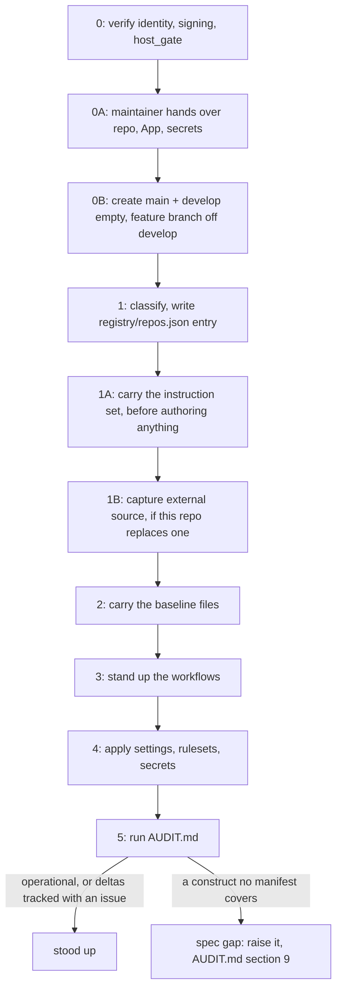

# STANDUP.md

How an agent takes a repository from nothing (or a partial state) to **operational** against the fleet ground truth. This is the create-to-conformance procedure, and [`AUDIT.md`][audit] is its read-only verifier and owns the definition of done. Both read the same ground truth ([`registry/repos.json`][repos], the [`spec/`][spec] manifests, [`repo-config/`][repo-config], and the prose authorities [`GOVERNANCE.md`][governance], [`CODESTYLE.md`][codestyle] and [`WORKFLOW.md`][workflow]), so a repo stood up by this file passes the audit by construction.

Standing up a repo is **applying the manifests until the audit passes**, nothing more invented. If a repo needs a construct no manifest covers, that is a spec gap: raise it ([`AUDIT.md`][audit] section 9), never improvise a per-repo answer. This is the downward-audit model (standard-style repos the hub audits against their declared type), which the fleet uses because managing downstream divergence is too costly.



## 0. Verify Commit Identity and Signing, Before the First Commit

Do this before `git init` or any commit, because the window closes at the first one. A repo whose initial history is unsigned or committed under the wrong identity cannot be cleanly repaired: `Require signed commits` blocks the first `develop -> main` release, re-signing that history is a non-fast-forward the `Block force pushes` rule rejects, and completing it needs the ruleset temporarily disabled plus a maintainer force-push that [`docs/repo-config.md`][repo-config-doc] forbids an agent to perform. Greenfield repos where signing is live before the first commit never hit this.

**Verify the inherited configuration. Never set it.** The host already carries the correct identity, so a repo-local `user.email` is redundant at best and a wrong identity at worst, and it silently shadows the global it overrides. Read the **`--global`** scope explicitly, and run these before there is a repo:

```shell
git config --global --get user.email        # the GitHub noreply address, per GOVERNANCE.md "Git and Commit Rules"
git config --global --get commit.gpgsign    # true
git config --global --get user.signingkey   # set
git config --global --get gpg.format        # ssh for an SSH key; unset or openpgp for GPG

# prove signing works with a live scratch commit in a disposable scratch repo, not this
# repo (its own git init is still section 0B, below), and not an agent-liveness probe
# (ssh-add -L, gpg --list-secret-keys): a host that signs straight from a key file with no
# agent running passes cleanly and fails that probe. See
# .agents/skills/git-commit-conventions/SKILL.md "Signing, verified not configured" for why.
# One physical line, not backslash-joined, so the whole probe copy-pastes cleanly into a shell.
d=$(mktemp -d "${TMPDIR:-/tmp}/sign-check.XXXXXX") && ( trap 'rm -rf "$d"' 0; email=$(git config --global --get user.email) && git init -q "$d" && git -C "$d" commit --allow-empty -q -m check && out=$(git -C "$d" log -1 --format='sig=%G? author=%an <%ae> committer=%cn <%ce>') && echo "$out" && ae=$(git -C "$d" log -1 --format='%ae') && ce=$(git -C "$d" log -1 --format='%ce') && case "$out" in sig=G\ *|sig=U\ *) true ;; *) false ;; esac && case "$email" in *@users.noreply.github.com) true ;; *) false ;; esac && [ "$ae" = "$email" ] && [ "$ce" = "$email" ] )
```

`--global` rather than the effective config, because the effective value depends on where the command runs: inside any existing repository a repo-local override wins, so a bare `git config --get user.email` there reports that repository's identity and hides the host setting this step exists to check. The two scopes together are what make the result sound, since this block proves the host is right and the block below proves nothing shadows it.

**Verify the host's tools in the same step, since identity is only half of what a standup needs from a machine.** The tools carry version floors, and a host below one does not fail cleanly: it answers `--version`, looks healthy, and produces a wrong answer, which is how both host defects this fleet has hit arrived.

```shell
python3 scripts/host_gate.py            # from a hub checkout, against the fleet floors in spec/host-tools.json
```

**No `--repo` here, and that is the one place in these procedures where it is omitted deliberately.** The flag points the gate at a repo's own `host-tools.json` so its floors are layered over the fleet ones, and at this step there is no repo to point it at: the target does not exist yet, since this section runs before the `git init` in section 0B, and the file itself arrives with the baseline in section 2. So this run checks the fleet floors, which is all that is knowable now.

**Re-run it with `--repo` once section 2 has carried the file**, because a bare run reads no declaration but the one at its own working directory, so any floor the target adds goes unapplied. The gate warns when its working directory sits inside a repo whose overlay it did not read, and no warning can name a target that does not exist yet, so this re-run is the only thing that counts the target's floors:

```shell
python3 scripts/host_gate.py --repo <path-to-target-checkout>   # after section 2, so the repo's own floors count
```

A finding at either point is a **host** misconfiguration to fix on the machine or surface to the maintainer, never something to patch per repo, and [`docs/host-setup.md`][host-setup] is the contract it checks.

The scratch commit exercises the whole signing pipeline rather than one delivery path, since `ssh-add -L` or `gpg --list-secret-keys` only prove an agent holds a key and say nothing about a host that signs straight from a key file with no agent running at all, a live and correctly configured case [git-commit-conventions][git-commit-conventions] documents in "Signing, verified not configured", the same rules [GOVERNANCE.md "Git and Commit Rules"][governance-git-and-commit-rules] points to. Signing is **SSH or GPG**, so this judges the configured format by its actual result (`sig=G`, or `sig=U` for a cryptographically good signature from an unrecognized signer, either a GPG key whose trust is merely undefined or an SSH key missing from the local `allowed_signers` file), never by which delivery path produced it. A missing `--global` value, `sig` not reading `G` or `U`, or either printed email not matching the noreply address is a **host** misconfiguration to surface to the maintainer ([`docs/host-setup.md`][host-setup] is the setup procedure), not something to patch per repo. Patching it locally hides a broken host that then produces wrong identities in every other repo on that machine.

After `git init` and before the first commit, confirm the repo added no override of its own. This one needs a repository, since `--local` fails outside one. Read it here and run it in section 0B, which places it between the init and the first commit, so nothing here is a prompt to init early:

```shell
git config --local --get user.email || true    # expect no output
```

**The finding is a printed value, never the exit code.** An unset key prints nothing and makes `git config --get` exit `1`, so reading that as failure inverts the check, and the tolerant tail turns it into a zero exit in any case, which leaves empty output as the whole of the passing result. The tail is in the snippet above so a copy into a `set -e` script does not abort on the expected case.

After the first commit, confirm it took with `git log -1 --format='%G? author=%an <%ae> committer=%cn <%ce>'`, so the passing result is `G` plus the expected `noreply` address in **both** identities. Read both rather than the author alone: the rule governs the `author` and the `committer` together, GitHub verifies the signature against the **committer**, and a rebase, amend, or cherry-pick rewrites the committer while leaving the author untouched, which is exactly the case an author-only check passes and should not. `git verify-commit HEAD` is the pass/fail form, exiting non-zero on a bad signature and writing its "Good signature" line to stderr rather than emitting a status letter. Section 0B's block runs this line too, in the position described here, which is the same split as the check above.

## 0A. Hand Over What Only the Maintainer Can Supply

**Nothing in this procedure creates the GitHub repository.** Creating one is an outward-facing write that [GOVERNANCE.md "Repository Boundaries and Write Safety"][governance-repository-boundaries-and-write-safety] puts behind explicit per-session permission, so the agent asks for it rather than assuming it exists. Hand this list over before step 1, so it is a checklist at the start rather than a discovery at step 4:

- **The repository**, with its owner, name, and visibility.
- **The GitHub App installed on it.** An App that is created but not installed does not work, per [`repo-config/README.md`][repo-config-readme].
- **The App secret values**, in the Actions and Dependabot stores both.
- **Every publish credential and environment the repo's mechanisms declare** in [`spec/secrets.json`][secrets], including any environment a deploy gates on.

**A repo with no remote is not partially stood up. It is not started.** Steps 0 through 3 complete locally and report progress with no repository in existence, so local progress is not evidence of onboarding progress. [`AUDIT.md`][audit] is the check that would catch it, and it reads a live repo, so the one instrument that detects this condition is unavailable exactly while it holds.

**Escalate a blocking prerequisite the moment it is found, rather than carrying it.** In a task list a pending task and a blocking prerequisite look identical, and the second quietly becomes the first as work continues around it. Stop at the step that needs the missing input and say which input it is.

## 0B. Create the Branches, Before the First Standup Commit

**Create both long-lived branches empty and do the whole standup on a feature branch off `develop`.** An agent that starts committing onto whichever branch `git init` produced is writing the repo's permanent history, and every step below is exploratory work that has no business being permanent. Doing this first means nothing ever has to be cleaned off `main` or `develop`, because the only commit either carries is the empty one it starts from and every change after it arrives by pull request.

1. **Create `main` carrying nothing.** A git branch cannot exist without a commit, so carrying nothing means exactly one signed empty root commit, and section 0's signing window applies to it like any other.
2. **Create `develop` from `main`**, also carrying nothing, so the two start level.
3. **Create the first feature branch from `develop`** and run every step below on it, through the audit in step 5.
4. **Add the repository on GitHub and apply the configuration while still on that branch**, which is step 4 and needs no branch of its own.
5. **Open a normal pull request into `develop`** when the standup is done, and let it squash like any other change.

Steps 1 through 3 are the block below, run before the repository exists on GitHub. It carries the procedure's only `git init`, so section 0 is read as its `--global` checks running ahead of this block and its two repository-scoped checks sitting inside it, rather than as an init of its own to run first.

```shell
git init                                                        # The host default may be master, which the rename below corrects.
git config --local --get user.email || true                     # Section 0's override check, whose passing case is no output.
git commit --allow-empty --message "Initial commit"             # The one signed empty root commit.
git log -1 --format='%G? author=%an <%ae> committer=%cn <%ce>'  # Section 0's verification of that commit.
git branch -M main                                              # Renames whichever branch git init produced, in a repo holding only it.
git branch develop                                              # From main, so the two start level.
git checkout -b "<feature-branch>" develop                      # Every step below runs here.
```

The rename runs unconditionally rather than behind a test of `init.defaultBranch`, because forcing it is correct whether the host produced `master` or `main` and a conditional is one more thing to get wrong. What makes the force safe is where the block runs, in a repository holding one branch and one commit, so it is a rename with nothing to collide with rather than a general-purpose one. In a repository that already carries a `main` the same line overwrites that branch, which is why this block belongs to a fresh `git init` and never to a repair. The rename is written `-M` rather than `--move --force` because `git branch` gained those long options later than the short one, so the long spelling would add a version floor for nothing. `git switch` and `git init --initial-branch` are newer still, which is why neither appears here. It is worth the care because [`docs/host-setup.md`][host-setup] checks that `git` is present and states no floor of its own. The placeholder is quoted for the reason step 4 gives, that an unquoted `<` is input redirection. Both of section 0's checks sit in the block rather than beside it, placed where that section requires them rather than left to a reader to interpolate, and each is read as section 0 reads it. On the second line the finding is the printed value and never the exit status, so the passing case is empty output. Reading `$?` there answers nothing, because `git config --get` exits non-zero on the unset key that is the wanted result and the tolerant tail then returns zero regardless, which is what keeps a copy of the block inside a `set -e` script from aborting on the expected case. On the fourth the passing result is `G` beside the noreply address in the author and the committer both, which reads the empty root commit as the first commit the signing window covers rather than as an exception to it. Push `main` and `develop` once the repository exists and **before** step 4 applies the rulesets, since [`repo-config/main.json`][repo-config-main] carries a `pull_request` rule, so an applied ruleset blocks the direct push that would otherwise seed the branch. Ordering it this way rather than relying on a bypass is deliberate, because who may bypass a ruleset is a human decision no payload declares, and `repo-config/configure.sh` reads the live list and preserves it rather than asserting one, so an agent cannot know from the payload whether a bypass exists.

**Committing onto `develop` and squashing afterwards does not work**, because `non_fast_forward` is set on both `develop` payloads and rewriting that history is exactly what the rule rejects. This is not hypothetical, since a repo stood up that way was correctly blocked at the point the history needed rewriting, with the standup already written into the branch it had to be lifted off.

**The protection is uneven, so on an operational repo this instruction is the only thing holding the line.** A release repo's `repo-config/develop.json` carries a `pull_request` rule that blocks a direct commit outright, while `repo-config/operational/develop.json` carries three rules, `deletion`, `non_fast_forward` and `required_signatures`, and none of them stops one. A conformant operational repo therefore accepts the commit that this step exists to prevent, and reports nothing wrong afterwards. That is a recorded disposition rather than an oversight, `accepted` in the [`docs/fleet-map.md`][fleet-map] register (G7): the allowance is the operational model's foundation, a standup runs on a feature branch either way, and a ruleset tightened for standup alone would leave a window where the live ruleset contradicts the registry's model, so this instruction stays the enforcement.

**On a public repo the squash is the one chance to leave the exploratory history out.** Standup is where a wrong secret value, a throwaway credential, and a run of noise commits accumulate, and a squashed feature branch publishes the result rather than the route to it.

## 1. Classify and Catalog

A repo lacking any entry is exactly what [`AUDIT.md`][audit] section 0's fleet membership check surfaces on a full sweep, a `DEFECT` naming the repo by its GitHub `full_name`. That finding is what should send an agent here in the first place for a repo nobody has stood up yet, rather than the omission sitting unnoticed (ptr727/ProjectTemplate#550).

Resolve the repo's type(s) with the [`AUDIT.md`][audit] section 2 detection rules, then write or repair its [`registry/repos.json`][repos] entry: `status`, `types[]`, `groundTruthBranch`, `hasDevelop`, `publish[]`, `requiredSecrets[]`, `consumerModel`, `releaseTrigger`, `workflowModel` (omit to take the `release` default), `configLayout`, and `driftNotes` that describe what the repo **actually is**. Run [`spec/validate.py`][validate] to confirm it classifies cleanly. The registry is ground truth about reality, not intent, and a `validate.py`-clean entry is still false if it disagrees with the live repo.

## 1A. Carry the Instruction Set, Before Authoring Anything

**Stop here until the instruction set is present and read.** The baseline in step 2 is one list, but it holds two kinds of file, and this kind is not a deliverable. `AGENTS.md`, `GOVERNANCE.md`, `CODESTYLE.md` and `WORKFLOW.md` are **the rules for producing every other file in the repo**, so carrying them late means everything authored beforehand was authored against unknown rules. The cost of that is rework rather than a warning, and it scales with how much got written first.

This is the same shape as step 0. Signing has to be live before the first commit rather than retrofitted, and governance has to be loaded before the first authored file for the same reason: the window closes quietly, and the repair is expensive out of proportion to the prevention.

Carry these before writing any repo content of your own:

- [`CLAUDE.md`][claude-md], [`AGENTS.md`][agents], [`GOVERNANCE.md`][governance], [`CODESTYLE.md`][codestyle], [`WORKFLOW.md`][workflow] and [`AUDIT.md`][audit], adapted rather than cloned for the ones that describe a repo.
- **`CLAUDE.md` is not optional decoration.** Claude Code reads `CLAUDE.md`, not `AGENTS.md`, so a repo carrying `AGENTS.md` alone never gets it into a Claude Code session's context at all, only into whatever an agent chooses to read on its own initiative mid-task, which is exactly the reliability gap that motivates carrying this file. It is a fixed, `verbatim`, whole-file carry with no repo-specific content. See `CLAUDE.md` itself for what belongs in it and what does not.
- **`.markdownlint-cli2.jsonc` and `cspell.json`**, which are the mechanical half. A rule nothing checks drifts silently, so a repo that carries the prose authorities without the linter configs has guidance and no gate. Scope a linter's **file set in the workflow** rather than relaxing either config, since `.markdownlint-cli2.jsonc` is carried `verbatim`.

Then **read** `CODESTYLE.md` and the `GOVERNANCE.md` documentation-style rules, rather than only placing the files. Comment shape, one sentence per line, US spelling and the character rules all govern the code and config you are about to write, and none of them are recoverable cheaply afterwards.

**A caution about learning house style from the carried files.** Some carried configuration still holds comment blocks that predate the current rules, so read the rule text as the authority and do not infer style from a file's existing formatting. Where a carried file and the rules disagree, the rules win and the file is a backlog item for the hub.

## 1B. Capture the Source, Before It Changes

**This step applies only when the repo's content comes from a live external system the repo replaces.** The capture is independent of every other step here and runs as early as the source is reachable, ahead of scaffolding where the source is paid for, rented, or scheduled for shutdown. It is the same window-closes shape as steps 0 and 1A, with a harder edge: a source system is not under version control, so nothing about it can be re-derived once it stops serving.

Capture the source, verify the capture **against the source**, and hold the verification artifacts (a golden URL list, an export manifest of content hashes) as the before-snapshot, then convert from that rather than from the live system. [`docs/content-import.md`][content-import] holds the three failures that make a capture look complete when it is not: an export that omits externally hosted media, a sitemap that is not the URL contract, and an HTTP fetch that returns a derivative rather than the original. Each reconciles cleanly against the artifact the source hands you, which is why the verification has to read the rendered pages, a live crawl, and content hashes instead.

## 2. Carry the Baseline Files

After the baseline files are present, apply every applicable whole-tree declaration from the fetched hub checkout. The carry tool resolves the repository through the registry and refuses a shared or dirty target worktree.

```shell
python3 scripts/carry.py check <Repo> --target /path/to/worktree
python3 scripts/carry.py apply <Repo> --target /path/to/worktree
```

Read every extra-path report before `apply` prunes it. Finish with another `check`. It uses the same comparison as `apply` and must report clean.

Copy every [`spec/files.json`][files] entry whose `appliesTo` matches the repo's **selector set**, **adapted, not cloned**. The selector set is the repo's `types` plus its `workflowModel`, `releaseTrigger`, and `consumerModel`, so filtering on type alone silently drops the entries a non-type selector carries ([`spec/scope-model.md`][scope-model] defines the four namespaces and how they resolve). The prose files (`CODESTYLE.md`, `README.md`, and the like) describe the repo's own toolchain, so adapt them to reality rather than propagating template specifics verbatim (see the "Adapt before propagating" callout in [`CODESTYLE.md`][codestyle], since a verbatim copy that misdescribes the repo is rejected in review). The baseline covers `WORKFLOW.md`, `version.json`, `.github/dependabot.yml`, `.editorconfig`, `.gitattributes`, `host-tools.json`, the linter configs, and the per-type files (`.vscode/tasks.json` from the language's snippet, `codecov.yml`, `.dockerignore`, `Docker/README.md`). Repository settings and ruleset payloads stay in the hub's `repo-config/` directory.

Carry `AGENTS.md`'s skill-dependency pointer paragraph, the one naming `scripts/skills_install.py` and where the fleet's Skills live, as one more verbatim unit in this same step, not a separate pass. It reads like boilerplate next to the surrounding text a new repo adapts to describe itself, and a repo that carries `AGENTS.md` without it stands up with no path to the fleet's Skills at all. `RESYNC.md` carries the identical instruction for a repo already stood up, so the two procedures agree on what belongs in every copy.

**`version.json` is a file to carry and a floor to choose.** [`WORKFLOW.md`][workflow] D3.3 makes its `version` field the repo's own major.minor floor, with NBGV appending the git height as the patch, so the number carried in with the file is a claim about a release history the new repo does not have. Set it deliberately, at standup, before the first release:

- **A new project starts at `1.0`**, or at `0.1` while it is deliberately pre-release and its consumers are told so.
- **A project with releases behind it keeps its established scheme**, adapted to NBGV rather than restarted. The field carries a major.minor floor and NBGV counts the patch from the git height rather than from where the published sequence stopped, so a floor matching the published major.minor emits a patch counted from that floor's first commit, which lands under an existing tag whenever the published patch ran ahead of the height. Raise the minor above the highest published one, which clears the collision and leaves nothing to maintain. `versionHeightOffset` shifts the height instead, at the cost of an offset the repo carries from then on. Either way `nbgv get-version` prints the computed version, and it has to sort above the latest tag before the first release.
- **A repo that ships no package still chooses.** An operational or source-only repo releases a tag and a source archive, which is a published version like any other, so "nothing consumes it" is not a reason to leave the carried number in place.
- **Carry only the fields the repo uses.** `nugetPackageVersion` is packaging configuration for a NuGet publisher, so a repo that publishes no package drops the block rather than carrying a setting nothing reads. `publicReleaseRefSpec` names the repo's own default branch, which D3.2 requires it to agree with.

**This decision is effectively one-way, which is why it belongs here.** Once a repo publishes against a floor, lowering it regresses the released version order, so a floor that was never chosen is kept rather than corrected. Inherited floors are the observed failure, not a hypothetical one: four operational config repos run on a floor none of them picked and have released against it.

**`host-tools.json` is carried at the repo's root, and it is not the fleet declaration.** [`spec/host-tools.json`][host-tools] states what every repo's procedures need and is the hub's to change. The carried root file states what this repo needs **beyond** that, so it is where a tool only this repo uses, or a floor only this repo requires, is declared. [`scripts/host_gate.py`][host-gate] layers the root file over the fleet one, tighten-only: an entry may add a tool, raise a floor, or turn an optional tool required, and may not lower a floor or turn a required tool optional, since that retires a fleet check from inside the repo it protects. A rejected relaxation is reported rather than dropped. A repo with nothing to add carries the stub with an empty `tools` list, the same footing as `OPERATIONS.md`, so the declaration is somewhere a reader finds rather than somewhere they must know to look.

**The carried copy drops the `$schema` pointer, and that is not an oversight to correct.** The schemas are hub-only and no selector carries one, so a relative pointer copied downstream resolves to a path that repo does not have, and a schema-aware editor then reports the file invalid for a reason the repo cannot fix. This is settled fleet practice rather than a new rule: this repo's own root `host-tools.json` carries `./spec/host-tools-local.schema.json` and every downstream copy of that carried file omits the key. Copy the structure and leave the pointer behind.

**Repo-specific content has a declared destination, not a judgment call.** The baseline is what a repo *carries*. Anything the repo knows that the fleet does not needs somewhere to live, and improvising a location per repo is what the destinations in [`spec/section-model.md`][section-model] exist to prevent. Four topical docs take it, chosen by what the content **is**:

- [`CODESTYLE.md`][codestyle]: the repo's language and formatting conventions beyond the carried rules.
- `ARCHITECTURE.md`: how a code repo is built, its module layout, data flow, and design decisions.
- `OPERATIONS.md`: how the repo is run, under the headings `Local Verification`, `Runbooks`, `Backup and Recovery`, `Logs and Debugging`, `Tool Usage`, and `Configuration Layout`. `Local Verification` leads because it is the only pre-merge heading, and it names the part of the repo's contract CI structurally cannot exercise.
- `TODO.md`: the repo's running backlog, per [`spec/readme-structure.md`][readme-structure]. It keeps open work out of the README's section order, where it does not belong and changes on a different cadence from everything around it.

**`OPERATIONS.md` is required on every repo**, not optional, so it appears in the baseline above with `appliesTo: "*"`. It is presence-checked only, the same footing as `README.md` and `HISTORY.md`, so its content is entirely the repo's own and a repo with little to say still carries the file as a stub, meaning those six headings with no content under them, for which this repo's own `OPERATIONS.md` is the worked example. Do not read the `operational` workflow model into the requirement, because that selector describes where config lives rather than whether the repo has runbooks, and a repo that publishes to a package registry or deploys a site has operational surface under either model. It is the operational analogue of `ARCHITECTURE.md`, and it is where an `AGENTS.md` split puts the repo-specific half, so real runbooks (a deploy procedure, a rollback, a retention policy, a credential rotation) go there rather than into a carried file. It is agent-instruction content, so it takes the inline-link exception the Markdown rules name rather than the reference-style default. `ARCHITECTURE.md` and `TODO.md` stay advisory and are required by no selector, so a repo with nothing to say in one carries no file rather than an empty one.

**A repo whose own stacks or scripts read local runtime credentials from disk documents that under `OPERATIONS.md`'s `Configuration Layout` heading**, and the directory follows the repo-scoped secrets convention in [GOVERNANCE.md][governance-repo-scoped-secrets] rather than an ad hoc layout invented per repo.

Choose the destination while scaffolding rather than after. Repo-specific content left in a carried file is drift, which the audit lists as an undeclared section to reconcile, and reconciling it later means moving prose that downstream readers have already started trusting in the wrong place.

**Wire a local commit hook here, not after the fact.** `.husky/pre-commit` and `.pre-commit-config.yaml` are deliberately excluded from the baseline above (each repo's own formatters make the content repo-owned, per [`spec/divergences.json`][divergences]), so nothing in the carry step above wires one. Copy and adapt the applicable catalog snippet with `catalog/snippets/hub-fetch-run.py` alongside it, then enable it, before the section 5 audit run. Which shape applies, what the gate must cover, and the per-clone enablement steps are all in [`GOVERNANCE.md`][governance] "Running the Linters Locally (Known-Working Invocations)", not restated here. A freshly stood-up repo with nothing wired starts pre-failed on `parity.hooks`.

## 3. Stand Up the Workflows

Implement the Actions that satisfy [`WORKFLOW.md`][workflow] for the repo's type (its section 6 per-type walkthrough): the source-only subset for a source-only repo, the file-target leaf(s) for a publishing repo, the two-workflow shape for an operational config repo. Reuse [`catalog/snippets/workflows/`][workflows] as the reference implementation, satisfying the contract by outcome rather than byte for byte.

## 4. Apply Settings, Rulesets, and Secrets

**Read the remote and the repository before running anything else here**, since this is the first step needing either and every step before it passes without both:

```shell
git remote get-url origin                                 # expect a URL, not an error
gh repo view "<owner>/<repo>" --json nameWithOwner,visibility
```

The placeholder is quoted because an unquoted `<` is input redirection, so the line fails on paste against a file rather than against the repository.

Three conditions fail here, and the two commands together are what separate them:

- **No `origin`.** The checkout has nowhere to push even where the repository exists, and it is the state a local-only standup reaches with every step reporting success.
- **No repository.** It surfaces as a resolution error against whatever `configure.sh` calls first, which reads as a permissions or naming problem rather than as the missing prerequisite it is.
- **The two disagree.** Neither command checks this, so compare the `origin` URL against `nameWithOwner` and confirm they name the same repository.

Each is step 0A's escalation rather than something to work around.

Run `repo-config/configure.sh apply owner/repo release|operational` from a hub checkout at `main`, naming the repo being stood up and its model, to apply the fleet settings, Dependabot security features, and two rulesets idempotently (import the JSON, never hand-build it, per [`docs/repo-config.md`][repo-config-doc]). Then run `repo-config/configure.sh check owner/repo release|operational` from the same checkout. Pass the model explicitly because the repository is outside the registry during this step. Configure every required secret per [`spec/secrets.json`][secrets] (the registry `requiredSecrets[]` list plus the implicit baseline) in the right store(s), meaning Actions plus Dependabot where the mechanism needs it, and confirm no forbidden secret is present. The required check binds by name (`Check pull request workflow status job`) and turns green only after the PR workflow has run once, which is why this step follows step 3 rather than preceding it. A ruleset requiring a name no run has ever reported leaves the first pull request waiting on a status nothing produces, and on an operational repo the `develop -> main` promotion is a pull request too, so the same wait applies there.

For a **private** repo, confirm the account-wide toggle at `https://github.com/settings/security_analysis`, `Dependabot on self-hosted runners`, is off, along with `Automatically enable for new repositories` beside it. If self-hosted routing is wanted instead, register a matching self-hosted runner rather than disabling the toggle. Left on with no self-hosted runner registered on the account, Dependabot's own update jobs queue for up to 24 hours, then get cancelled. That cancelled-with-zero-steps pattern is the only Actions-API-visible signal, not an explicit cause, and ordinary CI is unaffected. The account-setting root cause surfaces only as a `Self-hosted runner unavailable` message on the repo's own Dependabot page. GitHub never routes a public repo through this setting, so a public standup is unaffected (ptr727/ProjectTemplate#1015). A repo standing up from a **partial state** may already carry queued or cancelled jobs from before this check ran. Fixing the toggle does not rerun those. A manual `Check for Updates` click on the repo's own Dependabot page does.

## 5. Verify: Run the Audit

Run [`AUDIT.md`][audit] end to end. The repo is stood up only when it is **operational** (every applicable check passes) or its residual deltas are tracked in `reports/<repo>/audit.md` plus an issue. Converge any drift through a Copilot-reviewed target PR ([`AUDIT.md`][audit] section 10), and the maintainer merges. A repo left partially set up and unrecorded is the exact failure this procedure exists to prevent.

## Onboarding a New Repo Type

When a repo matches no existing type, the work is onboarding a **type**, not just a repo:

1. Add the type to [`spec/project-types.json`][project-types] (`detect[]`, plus `checks` with verdict tiers and intent refs) and any per-type files to [`spec/files.json`][files], then add its publish mechanism to [`spec/secrets.json`][secrets] if new. Add the type's token to [`spec/scope-model.md`][scope-model] and the type itself to [`spec/type-model.md`][type-model] in the same change, which that file's own rule requires. A type publishing to a **new destination** also needs the target added to the closed `target` enum in [`registry/repos.schema.json`][repos-schema] and mapped in `targetMechanisms`, or the first repo declaring it fails `spec/validate.py` with an unknown-target error.
2. Add the reference workflow leaf to [`catalog/snippets/workflows/`][workflows] and document the type's [`WORKFLOW.md`][workflow] walkthrough. A leaf must not be named `build-*-task.yml` unless the type really is a build target, since `source-only.detect` is literally "no `build-*-task.yml`" and the name alone would make that declaration false for any repo carrying both.
3. Add the type to the [conformance matrix][matrix] and run the cold-start self-test until a context-free agent stands it up to operational.

## Self-Test: Cold-Start Conformance

The onboarding docs are sufficient only if a **context-free agent stands up each supported repo shape from them alone**, a shape being the project type(s) plus the workflow model (`operational` is a `workflowModel` overlay, not a `spec/project-types.json` type). Run this whenever the onboarding docs or manifests change, and periodically as a fleet health check:

- For each shape in the [conformance matrix][matrix], task a fresh agent (no prior context) with "Using only this repo's docs, stand up a `<shape>` repo," pointing it at this file.
- Run [`AUDIT.md`][audit] against the result. Record pass or fail, and the first doc gap that tripped the agent, in the [conformance matrix][matrix].
- Iterate the **docs and tooling** (not the agent's memory) until every supported shape stands up cold to operational. A shape that cannot be stood up cold is a documentation defect, tracked like any other.

The same [`AUDIT.md`][audit] run is the on-demand audit for any known repo, and its report lists deviations and repo-specific deltas. The self-test and the fleet audit are one procedure, pointed at a new repo or an existing one.

<!-- Workflow -->

[workflows]: ./catalog/snippets/workflows/

<!-- Repo -->

[agents]: ./AGENTS.md
[audit]: ./AUDIT.md
[claude-md]: ./CLAUDE.md
[codestyle]: ./CODESTYLE.md
[content-import]: ./docs/content-import.md
[divergences]: ./spec/divergences.json
[files]: ./spec/files.json
[fleet-map]: ./docs/fleet-map.md
[git-commit-conventions]: ./.agents/skills/git-commit-conventions/SKILL.md
[governance]: ./GOVERNANCE.md
[governance-git-and-commit-rules]: ./GOVERNANCE.md#git-and-commit-rules
[governance-repo-scoped-secrets]: ./GOVERNANCE.md#repo-scoped-secrets
[governance-repository-boundaries-and-write-safety]: ./GOVERNANCE.md#repository-boundaries-and-write-safety
[host-gate]: ./scripts/host_gate.py
[host-setup]: ./docs/host-setup.md
[host-tools]: ./spec/host-tools.json
[matrix]: ./reports/conformance-matrix.md
[project-types]: ./spec/project-types.json
[readme-structure]: ./spec/readme-structure.md
[repo-config]: ./repo-config/
[repo-config-doc]: ./docs/repo-config.md
[repo-config-main]: ./repo-config/main.json
[repo-config-readme]: ./repo-config/README.md
[repos]: ./registry/repos.json
[repos-schema]: ./registry/repos.schema.json
[scope-model]: ./spec/scope-model.md
[secrets]: ./spec/secrets.json
[section-model]: ./spec/section-model.md
[spec]: ./spec/
[type-model]: ./spec/type-model.md
[validate]: ./spec/validate.py
[workflow]: ./WORKFLOW.md
