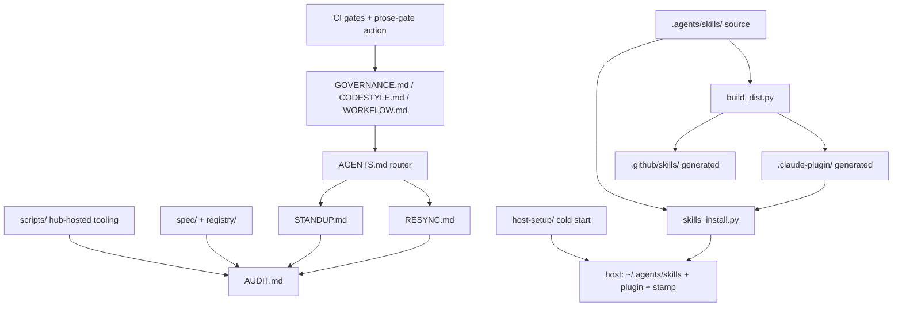
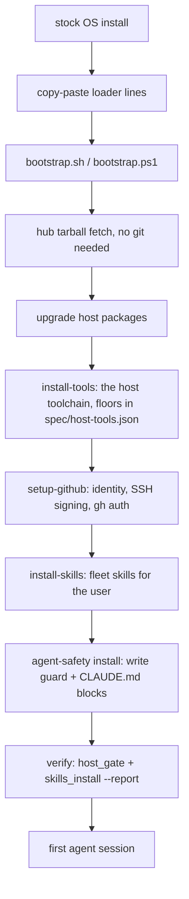
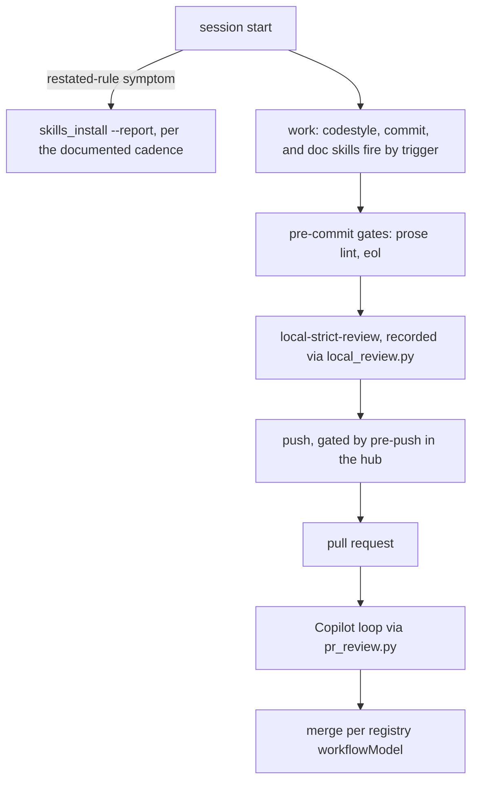
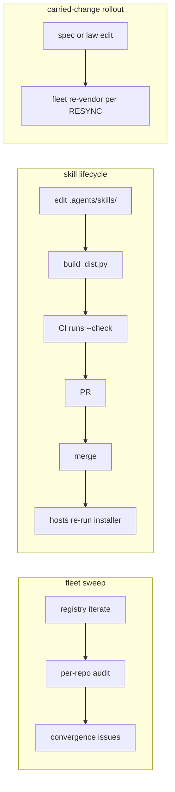
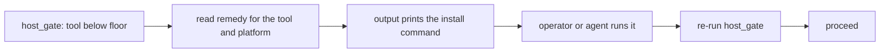

# Fleet Map and Gap Register (Hub-Only)

The **map** of how a human or an agent enters the fleet system, the **register** of the gaps and loose ends between its parts, and the roadmap that closes them. This doc is **hub-only** and is not carried downstream, because it describes the hub's own seams rather than a fact about any one repo. It is a map and never the procedure: [`AGENTS.md`][agents], [`STANDUP.md`][standup], [`RESYNC.md`][resync], and [`AUDIT.md`][audit] keep authority over their flows, and where this doc and a procedure doc disagree, the procedure doc wins and this map is what needs fixing.

**Maintenance rule.** A pull request that closes a register gap edits that gap's row and detail block in the same change, per [GOVERNANCE.md "Durable Knowledge and Self-Improvement"][governance-durable-knowledge]. A register describing a gap that is already closed is itself stale prose, so the register is only trustworthy while this rule holds. The same rule covers the map: a pull request that changes a mapped seam, or a flow this doc draws or points to, updates this doc in the same change.

## Table of Contents <!-- omit from toc -->

- [Scope and Non-Goals](#scope-and-non-goals)
- [System Map](#system-map)
- [Entry Points](#entry-points)
  - [Pre-Agent Cold Start](#pre-agent-cold-start)
  - [A New Repository](#a-new-repository)
  - [A Stale Repository](#a-stale-repository)
  - [Daily Development in a Conformant Repository](#daily-development-in-a-conformant-repository)
  - [Hub-Side Operations](#hub-side-operations)
- [Skills Install Model](#skills-install-model)
- [Gap Register](#gap-register)
- [Proposed Skills](#proposed-skills)
  - [audit-a-repo](#audit-a-repo)
  - [workflow-ci-contract](#workflow-ci-contract)
  - [skill-lifecycle](#skill-lifecycle)
  - [agent-conduct](#agent-conduct)
- [Peer Messaging](#peer-messaging)
- [Simplified Technical English Evaluation](#simplified-technical-english-evaluation)
- [Adoption and Operation Roadmap](#adoption-and-operation-roadmap)
  - [P0: This Pull Request](#p0-this-pull-request)
  - [P1: Close the Install Model](#p1-close-the-install-model)
  - [P2: Close the Skill Coverage](#p2-close-the-skill-coverage)
  - [P3: Audit-Depth Decisions](#p3-audit-depth-decisions)
  - [P4: Steady State](#p4-steady-state)
- [Decision Ledger Cross-References](#decision-ledger-cross-references)

## Scope and Non-Goals

This doc governs five things: the entry-point routing map, the gap register with a defined handoff per gap, the resolved skills install model, the proposals for new skills, and the phased roadmap. It does not author skills (skills ship through the [`.agents/skills/`][skills-readme] pipeline in changes of their own), does not restate any procedure, and treats multi-agent coordination as a documented pattern only, with the rules in [`docs/peer-messaging.md`][peer-messaging]. The version history that produced the current skill-based model is in [`HISTORY.md`][history], so this doc states only what is.

## System Map

The layers, one line each. The lifecycle docs route and procedure ([`AGENTS.md`][agents] routes, [`STANDUP.md`][standup] creates, [`RESYNC.md`][resync] re-lines, [`AUDIT.md`][audit] measures). The law docs hold the rules ([`GOVERNANCE.md`][governance] cross-cutting, [`CODESTYLE.md`][codestyle] per language, [`WORKFLOW.md`][workflow] the CI/CD contract). The machine ground truth is [`spec/`][files] plus [`registry/repos.json`][repos]. The hub-hosted tooling is [`scripts/`][scripts-readme], reached rather than carried. The skills source of truth is [`.agents/skills/`][skills-readme], and [`scripts/build_dist.py`][build-dist] generates the GitHub Copilot tree and Claude Code plugin from it. [`scripts/skills_install.py`][skills-install] installs the host-scoped forms. [`host-setup/`][host-setup-doc] provisions a host from a stock OS. CI enforces the deterministic subset of the rules on every pull request.

## Entry Points

Five doors into the system. Each subsection names its flow, the docs that own it, and the closed register gaps that sit on its path. Where the owning procedure doc draws its own flow diagram, that diagram keeps authority and this map points to it rather than carrying a copy that can drift. The diagrams below draw only the flows no procedure doc draws.

### Pre-Agent Cold Start

A fresh OS install, no git, no agent. The operator copy-pastes the loader lines from [`host-setup/README.md`][host-setup-readme], and everything after that is scripted. No agent exists at this stage, so this path must work from prose and copy-paste alone.

Owned by [`host-setup/`][host-setup-readme] and [`docs/host-setup.md`][host-setup-doc]. The tools step also polices its own PATH: a stray copy shadowing a managed `uv`, `jq`, or `git-restore-mtime` install is named in the report and removed by an install or upgrade run when removal is safe. No open gaps sit on this path: G1, the skills install with no home in the provisioning flow, is closed and its row records the resolution.

### A New Repository

An agent is told to create or stand up a repo. The router of last resort is the byte-locked `Fleet Bootstrap` section of [`AGENTS.md`][agents], mirrored host-wide by the `CLAUDE.md` block the agent-safety installer deploys, so the routing reaches an agent even in a directory holding nothing.

The section-by-section flow is diagrammed at the top of [`STANDUP.md`][standup], and the routing into it in the `Fleet Bootstrap` section of [`AGENTS.md`][agents].

Owned by [`STANDUP.md`][standup], packaged as the `standup-a-repo` skill. No open gaps sit on this path: G2, the silent bare-run overlay skip, is closed and its row records the resolution.

### A Stale Repository

The hub has moved and a downstream repo is behind. The agent runs [`RESYNC.md`][resync] from a hub checkout, which runs [`AUDIT.md`][audit] end to end and applies the findings in a load-bearing order.

The routing and the load-bearing apply order are diagrammed at the top of [`RESYNC.md`][resync], the deletion triage in its section 4, and the audit pipeline with its verdicts in [`AUDIT.md`][audit].

Owned by [`RESYNC.md`][resync] and [`AUDIT.md`][audit], packaged as the `resync-a-repo` skill with the `carried-instruction-file-guard` and `copilot-instructions-keeper` skills firing inside it. No open gaps sit on this path: G3, the audit-to-install bridge, G4, the prose-deletion sweep, and G5, the intent-staleness advisory, are closed and their rows record the resolutions.

### Daily Development in a Conformant Repository

The steady state. An agent writes Python, C#, shell, or config in a repo that already conforms, and the codestyle, commit, and review skills fire by trigger.

Owned by the per-language sections of [`CODESTYLE.md`][codestyle] and the conduct skills. The gates node is the [`OPERATIONS.md`][operations] "Run the gates the way CI runs them" section, the local review node is the `local-strict-review` skill recorded through `scripts/local_review.py`, and the review node runs through [`scripts/pr_review.py`][pr-review]. The push node's gate is the hub's own `.husky/pre-push`, so on a downstream repo that edge is prose alone until a catalog snippet carries the hook. One open gap sits on this path: G13, the local review gate reaching the hub only, which is why the push node's own edge reads as prose on every other repository. G6, the unwired staleness check, and G7, the operational direct-commit allowance, are closed and their rows record the resolutions.

### Hub-Side Operations

Work on the fleet itself, run from a hub checkout: sweeping the fleet for drift, changing a carried rule, and changing the skills.

Owned by [`AUDIT.md`][audit] section 10, [`GOVERNANCE.md` "Hub-Hosted Tooling"][governance-hub-hosted-tooling], and [`.agents/skills/README.md`][skills-readme]. The runnable form of this door is [`OPERATIONS.md`][operations]: its "Audit the fleet" and "Apply or verify repository configuration" runbooks drive [`spec/audit.py`][audit-py] and the `repo-config/` apply, and its "Run the gates the way CI runs them" section runs [`scripts/repo_gate.py`][repo-gate] beside the prose gates. The gaps this path carried (G9, G10, G12) are closed: the four skills below cover the topics, the lifecycle, and the conduct rules, and the register rows record the resolutions.

## Skills Install Model

**Resolved: the install is global per user, and the work is closing its gaps, not adding a second model.** A per-repo pinned install was considered and rejected: it would let a repo's skills match its own state, but it forfeits coverage of ad-hoc sessions in no repo at all (which is where the incidents this fleet guards against actually happened), doubles the staleness surface, and adds a version-resolution mechanism the fleet does not need while the whole fleet tracks one hub.

The lifecycle chain as built: a skill is hand-authored under [`.agents/skills/`][skills-readme], [`scripts/build_dist.py`][build-dist] generates `.github/skills/` and the Claude Code plugin, and [`scripts/skills_install.py`][skills-install] installs both host-scoped forms per machine. The installer stamps the hub commit into `~/.agents/skills-install-stamp.json`. `skills_install.py --report` is the read-only staleness check and exits non-zero when the machine is behind the checkout.

Four wiring points close the model, and each is in place:

1. **Bootstrap** (G1, closed): [`host-setup/bootstrap.sh`][bootstrap] and [`bootstrap.ps1`][bootstrap-ps1] end their host mode with a skills step, driven by the `install-skills` pair in the platform directories, degrading gracefully when the `claude` CLI is absent (the overlay half still lands, and the stamp records the partial install). Each loader hands the commit it resolved to the installer, so a stamp written from the tarball tree stays checkable.
2. **Host contract** (G1, closed): [`docs/host-setup.md`][host-setup-doc] states the install and the verify command in its "Fleet Skills Install" section, and the [`README.md`][readme] "Using This Repo" section names the skills install among its four deployed things.
3. **Session entry** (G6, closed): the tail of [`AGENTS.md`][agents] says a rule that keeps needing restating signals a stale install, and the `fleet-conformance-check` skill runs the report and states the cadence, so the symptom routes to the check without new tooling.
4. **Refresh cadence** (G6, closed): [`docs/host-setup.md`][host-setup-doc] "Fleet Skills Install" states it: re-run the installer when `--report` exits non-zero, and after any hub merge that touches `.agents/skills/`. The maintainer runs it by hand, and an automated refresh is deliberately out of scope until the fleet has evidence the manual cadence fails.

## Gap Register

| ID | Gap | Owner | Phase |
| --- | --- | --- | --- |
| G1 | Skills install is absent from the cold-start flow | script + doc | closed |
| G2 | Host-tools repo overlay is silently skippable | script + doc | closed |
| G3 | A failed tool floor names no install remedy | spec + script | closed |
| G4 | Deletion sweeps miss prose describing the deleted path | doc | closed |
| G5 | Intent-fidelity carried files have no drift detection | spec + decision | closed |
| G6 | Session entry never checks skill staleness | doc + skill | closed |
| G7 | Operational develop PR-only rule is prose-enforced | decision | closed |
| G8 | Generated plugin can ship stale with no CI gate | CI | closed |
| G9 | WORKFLOW.md and AUDIT.md have no skill coverage | skill | closed |
| G10 | The skill lifecycle itself has no skill | skill | closed |
| G11 | Peer messaging is live but undeclared | doc | closed |
| G12 | General conduct rules have no skill | skill | closed |
| G13 | The local review gate reaches the hub only | script + doc | open |

Each gap's handoff below states who detects it, what closes it, and the test that proves it closed. The handoff sentence is the contract the closing pull request implements.

### G1: Skills Install Is Absent From the Cold Start (Closed)

- **Gap** - A host bootstrapped end to end via `host-setup/` had every tool and no fleet skills, because no provisioning step ran [`scripts/skills_install.py`][skills-install].
- **Resolution** - The bootstrap host mode ends with a skills step: `install-skills.sh` and `install-skills.ps1` drive the installer from the fetched tree, a `--skills` action runs the step on its own, and the bootstrap report reads `--report` beside the other status lines. Each loader hands the commit it resolved to the installer via `SKILLS_SOURCE_COMMIT`, so the stamp written from a tarball tree stays checkable and `--report` exits zero on a fresh host, which is this row's closing test. [`docs/host-setup.md`][host-setup-doc] carries the "Fleet Skills Install" section with the verify line, and [`README.md`][readme] "Using This Repo" names four deployed things.
- **Decisions** - The `claude` CLI stays out of [`spec/host-tools.json`][host-tools]: a Codex-only machine is a complete machine, so the installer degrades where the CLI is absent, landing the overlay half and recording the partial install in the stamp. The skills step is the recorded exception to `host-setup/`'s no-Python and independent-fetchability rules, and it runs last in a stand-up so `install-tools` provides its interpreter first.
- **Cross-links** - [#671][issue-671] and [#673][issue-673] touch the same `host-setup/` scripts and stay open on their own tracks.

### G2: Host-Tools Repo Overlay Is Silently Skippable (Closed)

- **Gap** - [`scripts/host_gate.py`][host-gate] run without `--repo` read only the declaration at its own working directory, so a run started in a subdirectory of a repo carrying a `host-tools.json` overlay skipped that overlay without a word.
- **Resolution** - A bare run whose working directory sits inside such a repo prints a warning naming the overlay's directory and the `--repo` re-run that counts it, asserted by the `TestBareRunOverlayWarning` cases in `scripts/tests/test_host_gate.py`. An explicit `--repo` and `--no-local` each stay silent, since both are a choice the caller made. [`STANDUP.md`][standup] section 0 states the residual case the warning cannot cover, a target repo that does not exist yet, instead of the workaround sentence.

### G3: A Failed Tool Floor Names No Install Remedy (Closed)

- **Gap** - The tool catalog detected a stale tool, and the handoff back into `host-setup/` did not exist: a failed floor left the operator or agent to rediscover which installer provides the tool.
- **Resolution** - Each floored [`spec/host-tools.json`][host-tools] entry carries a per-platform `remedy` beside its `source`, and a below-floor failure prints it as a `REMEDY:` line, with a `host-setup/` path resolved against the checkout the gate runs from so the command is runnable as printed. The catalog's own note states the field's semantics.

- **Closing test** - [`scripts/tests/test_bootstrap.py`][test-bootstrap] asserts the mapping stays total per platform, with the one recorded not-applicable exception, and that a remedy handing back into an installer names a tool that installer manages. [`spec/validate.py`][validate] and the schema require a remedy on every hub floor. A repository overlay may still add a floor without one, in which case the failure degrades to the `INSTALL FROM:` source line.

### G4: Deletion Sweeps Miss Prose (Closed)

- **Gap** - A resync that deletes a carried file greps for the path and finds code uses, not prose describing the file without naming its path. A measured incident left a layout section describing a deleted script.
- **Resolution** - Split by what a pattern can reach. The named-path half is mechanized: the `dead-path` rule in [`scripts/prose_lint.py`][prose-lint] reports a Markdown mention (a backtick span, an inline link target, or a reference definition) of a path git once tracked and the tree no longer holds. Keying on deletion history is what scopes it: a proposed file a backlog names, another repository's layout, and a ref like `origin/develop` each have no history here and stay silent, and a manifest-declared carried path is exempt since the hub's own instance retires to a catalog snippet while docs keep naming the carried file. A hub-hosted path is exempt for the mirror-image reason, measured downstream rather than predicted: a repository that deleted its copy per a `retire` disposition still names the hub's, which is the pointer [`GOVERNANCE.md`][governance] "Hub-Hosted Tooling" requires of it, and the manifest exemption cannot reach that case because no repository carries `spec/files.json`. That set is a literal in the gate, since the prose-gate action can fetch the one file and no ledger beside it, and a test asserts it against the ledger's `retire` dispositions so a new retirement cannot land on one side only. The rule runs in the default set and in CI, where the checkout fetches full history because the rule stands down loudly in a shallow clone rather than pass blind. The name-shaped half, the description that names no path, is `accepted` as manual: no pattern reaches it, the same judgment the home-path rule records, so the [`RESYNC.md`][resync] section 4 read of the layout and operations sections stands and now names the lint beside it.
- **Closing test** - `TestDeadPath` in `scripts/tests/test_prose_lint.py`, including the shallow stand-down and the tree-clean assertion. The rule's first tree-wide run caught a real instance, [`docs/host-setup.md`][host-setup-doc] describing bind-mounts in the deleted `.devcontainer/` definitions, fixed by re-pointing at the catalog snippets.

### G5: Intent-Fidelity Drift Is Invisible (Closed)

- **Gap** - A carried file at `intent` fidelity was presence-checked only, so it could trail the hub by many revisions while the audit read clean. This class hid real drift before.
- **Resolution** - The advisory ships in [`spec/audit.py`][audit-py]: for each applicable intent unit the audit compares when the hub canonical and the repo copy each last changed, and a canonical changing later reports the copy as possibly trailing, at DRIFT and never failing. A copy content-identical to the canonical is skipped, being both current and the promotion candidate `spec/fidelity_honesty.py` exists to find. Measured on its first run: a fleet repo's carried `WORKFLOW.md`, `CODESTYLE.md`, and `.editorconfig` each reported as trailing hub changes made weeks earlier, findings no prior check produced.
- **Decisions** - The handoff imagined reporting the hub revision each unit was last reconciled against, and no reconciliation record exists anywhere, so the last-modified comparison is the implementable proxy and ships instead of inventing a per-repo stamp. The advisory therefore says possibly: a copy touched after the hub change without actually reconciling reads current, a blind spot stated in [`RESYNC.md`][resync] section 5, [`AUDIT.md`][audit], and [`spec/fidelity-model.md`][fidelity-model] rather than papered over.

### G6: Session Entry Never Checks Skill Staleness (Closed)

- **Gap** - A machine with stale or missing skills behaves like a machine that never installed them, and nothing at session entry said so. The symptom is a rule that keeps needing to be restated.
- **Resolution** - The cadence is stated in both places the row asked for. [`docs/host-setup.md`][host-setup-doc] "Fleet Skills Install" directs a re-run of the installer when `--report` exits non-zero and after any hub merge touching `.agents/skills/`, and the `fleet-conformance-check` skill carries the same cadence in its own "Refresh cadence" section, routing the restated-rule symptom to the report it already runs. No new tooling, by design: the trigger is suspicion, and session entry stays uninstrumented until the fleet has evidence the manual cadence fails.

### G7: Operational Develop PR-Only Is Prose-Enforced (Closed)

- **Gap** - [`repo-config/operational/develop.json`][repo-config-readme] carries deletion, non-fast-forward, and signature rules only, so nothing blocks a direct commit that skips the feature-branch instruction during a standup.
- **Resolution** - Closed `accepted`, mirroring the [`spec/divergences.json`][divergences] vocabulary, with the disposition recorded where the exposure is described: [`STANDUP.md`][standup] section 0B states it beside its uneven-protection warning. The allowance is the operational model's foundation per [`WORKFLOW.md`][workflow] "Branch Model", and a standup runs on a feature branch either way, so the exposed interval is the tail of a procedure the instruction already governs.
- **Decisions** - The considered alternative, applying the release `develop` payload during standup and swapping to the operational payload after the closing audit, was declined: it adds a swap step that can be forgotten and a window where the live ruleset contradicts the registry's declared model, buying mechanical enforcement only for an interval the instruction already covers. A forgotten swap would surface as a ruleset defect on the next audit, which is real, and so would the contradiction it spends the interim in.

### G8: Generated Plugin Can Ship Stale (Closed)

- **Gap** - `.github/skills/` and `.claude-plugin/` are generated from `.agents/skills/`, and a merge that edits the source without re-running [`scripts/build_dist.py`][build-dist] would ship stale distributions.
- **Resolution** - [`.github/workflows/validate-task.yml`][validate-task] runs `build_dist.py --check` as its own step in the lint job, on every pull request, and the required aggregator check gates on that job. A PR desyncing a generated tree therefore fails the required check, which is this row's closing test.
- **Provenance** - The step landed in [#676][pr-676], which predates this register's merge, so this row's original `Checked` claim was stale on arrival. Recording that here rather than silently deleting the row is the maintenance rule doing its job.

### G9: WORKFLOW.md and AUDIT.md Have No Skill (Closed)

- **Gap** - The largest law doc ([`WORKFLOW.md`][workflow], the D1-D9 contract) and the measurement procedure ([`AUDIT.md`][audit]) had no skill surface, while every other procedure and language did. Thirteen [`GOVERNANCE.md`][governance] sections were likewise doc-only.
- **Resolution** - The `workflow-ci-contract` and `audit-a-repo` skills package the two docs in the kept-authority shape (the doc keeps the full rules, the skill is the summary that routes into it). The [`AGENTS.md`][agents] rule map carries a disposition per section: `Workflow YAML Conventions` and the three conduct sections are annotated with their surfacing skill, and a paragraph after the table states why each remaining unannotated section is doc-only by decision, so absence reads as a choice rather than an oversight. Both closing tests hold: the skills ship, and the map carries the dispositions.
- **Provenance** - All four phase-2 skills shipped in one pull request at the maintainer's direction, superseding the one-pull-request-per-skill note this doc carried, with `skill-lifecycle` authored first inside it so the others follow its procedure.

### G10: The Skill Lifecycle Has No Skill (Closed)

- **Gap** - Authoring, changing, and retiring a skill was governed by scripts and scattered prose, so the agent most likely to get it wrong (one editing a skill) had no skill watching it.
- **Resolution** - The `skill-lifecycle` skill packages the pipeline (source-versus-generated split, `build_dist.py` regenerate and `--check`, installer and stamp semantics, the doc-packaging pattern, trigger-description conventions), and [`.agents/skills/README.md`][skills-readme] defers to it for procedure, which is this row's closing test. It was authored first in phase 2 so the other three skills follow its procedure.

### G11: Peer Messaging Is Live but Undeclared (Closed)

- **Gap** - Agent-to-agent messaging works and has produced real findings, and no committed doc stated its rules, so each session rediscovered the capability without its boundaries.
- **Resolution** - [`docs/peer-messaging.md`][peer-messaging] declares the method and its safety rules, hub-only, shipped beside this doc in the P0 pull request, and the [`TODO.md`][todo] "Peer Messaging Between Agents as a Declared Method" item resolves to it. The row's phase cell trailed its own closure until the P3 register pass, which is the maintenance rule doing its job.

### G12: General Conduct Rules Have No Skill (Closed)

- **Gap** - The conduct layer (ask when unsure, never assume, verification before claiming done, delegation and token discipline) lived in carried [`AGENTS.md`][agents] sections and doc-only GOVERNANCE sections, with no skill firing at the moments those rules are violated.
- **Resolution** - The `agent-conduct` skill ships with the narrow decision-moment triggers the proposal specifies (about to claim done, about to assume, a failure just surfaced a lesson), summarizing `Verification Discipline`, `Communicating with the User`, and `Durable Knowledge and Self-Improvement`, which keep the full rules and carry the surfacing pointer, while the carried AGENTS.md sections stay the always-on layer.

### G13: The Local Review Gate Reaches the Hub Only (Open)

- **Gap** - `GOVERNANCE.md` "Verification Discipline" requires a recorded local review pass before every push toward a pull request, and only the hub carries the [`.husky/pre-push`][pre-push] hook that checks the receipt. Every other repository has the prose layer and no capture point, which is the layering working as designed but leaves the mechanical half unbuilt where most of the work happens.
- **Handoff** - `scripts/local_review.py` is hub-hosted and takes no `--repo`, reading whichever repository the working directory sits in, so a downstream repo reaches it as a hub checkout's copy run from its own worktree. Closing this means a `catalog/snippets/` pre-push companion to the existing pre-commit snippets, reaching the engine the way those reach the doc gates. The closing test is a downstream repo whose unreviewed push is refused and whose recorded push is not.
- **Known limits the snippet inherits** - The hook refuses rather than guesses in several states it cannot speak for, and every one of those is deliberate rather than incidental, so a snippet reproduces them rather than re-deciding them. The `local-strict-review` Skill's refusal table is the enumeration, kept in one place on purpose. Two of them read as shortcomings a snippet should fix and are not, so they are named here with the reason. **The refusal while the working tree holds tracked content differing from HEAD** reads as an unrelated cleanliness check: a push delivers HEAD while the engine's key covers the index and the working tree, so without it a fix staged over an unreviewed commit passes the gate while the push delivers the commit. **The fixed `develop` target, with no environment override**, reads as a gap to close for a repo whose working branch differs. Adding one reopens a measured bypass, since the variable is set inline on the very command being gated, by whoever is being gated, and naming the pushed branch as its own target collapses the change set to nothing and exits 0. A snippet needing another branch hard-codes it rather than reading it from the environment.

## Proposed Skills

Four skills close G9, G10, and G12, shipped through the [`.agents/skills/`][skills-readme] pipeline with `skill-lifecycle` authored first so the other three follow its procedure (in one pull request at the maintainer's direction, per the G9 provenance note). Scope and overlap were settled here before authoring, and each block below is the contract its skill implements.

### audit-a-repo

- **Scope** - Read-only measurement of a named repo ending in a committed report: the [`AUDIT.md`][audit] flow, the verdict taxonomy, what the deterministic runner covers and what stays hand-judged, and the rule that measuring never edits.
- **Trigger** - Asked to audit, measure, or verify conformance of a named repo, or to judge a conformance claim.
- **Packages** - [`AUDIT.md`][audit], which keeps authority.
- **Overlap** - Completes the triangle: `standup-a-repo` creates, `resync-a-repo` applies, and this measures. `fleet-conformance-check` stays the in-repo self-check with no named target. Each description disambiguates against the others, in the style the existing three already use.

### workflow-ci-contract

- **Scope** - The [`WORKFLOW.md`][workflow] behavioral contract: the D-guarantees, the seam contract, artifact lifecycle, NBGV versioning, validate-at-entry, and the per-type walkthroughs as references.
- **Trigger** - Writing or editing workflow YAML, adding or dropping a release target, or reasoning about why a publish did or did not fire.
- **Packages** - The YAML half of the pipeline. `operational-vs-release-workflow` keeps the git half (branching, promotion, publish policy), and the two descriptions state the split.
- **Overlap** - The source doc is large, so the skill is a summary plus binding rules with `references/` splits, the shape `comment-and-doc-style` already uses.

### skill-lifecycle

- **Scope** - Creating, changing, splitting, and retiring a skill: the source-vs-generated split, the regen and `--check` semantics of [`scripts/build_dist.py`][build-dist], the install and stamp semantics of [`scripts/skills_install.py`][skills-install], the doc-packaging pattern (summary in the law doc, full rules in the skill), and trigger-description conventions.
- **Trigger** - About to create or edit anything under `.agents/skills/` or `.claude-plugin/`.
- **Packages** - [`.agents/skills/README.md`][skills-readme] procedure content, which then defers to it.
- **Overlap** - None, and the absence was gap G10. Adjacent to `comment-and-doc-style` for SKILL.md prose only.

### agent-conduct

- **Scope** - The conduct rules with no skill surface: verification before claiming done, asking instead of assuming, recording a lesson when a failure surfaces one, and the delegation summary.
- **Trigger** - **Narrow, at decision moments**: about to claim work is done without having verified it, about to proceed on an assumption the user could cheaply confirm, or a failure just surfaced a durable lesson. Deliberately not always-on: the carried [`AGENTS.md`][agents] sections are the always-on layer, and an always-on conduct skill would duplicate them and spend the tokens the delegation rules exist to save.
- **Packages** - `Verification Discipline`, `Communicating with the User`, and `Durable Knowledge and Self-Improvement` from [`GOVERNANCE.md`][governance], which keep authority.
- **Overlap** - The commit, review, and doc skills each carry their own conduct rules already, and this skill points rather than restates where one of those owns the moment.

## Peer Messaging

Agent-to-agent messaging on one host is a working method with measured value, and its rules are declared in [`docs/peer-messaging.md`][peer-messaging]. The location decision from the [`TODO.md`][todo] item resolves to a hub-only doc first: the rules bind sessions on the maintainer's own hosts today, the transport cannot cross a machine boundary, and a carried GOVERNANCE section costs a fleet re-vendor for rules whose cross-host half is unverified. Promotion to a carried section or a skill is re-evaluated when cross-host messaging is verified or a downstream session demonstrably needed the rules and lacked them.

## Simplified Technical English Evaluation

Should agent-authored prose adopt ASD-STE100, a controlled language standard, or a lighter constrained house style? The criteria: does it improve agent instruction-following, does it compose with the enforcement that exists ([`scripts/prose_lint.py`][prose-lint] and the character-set and semicolon rules), what does it cost to author, and does its vocabulary fit a technical fleet.

| Criterion | Full ASD-STE100 | Constrained house style |
| --- | --- | --- |
| Instruction-following | One-instruction-per-sentence and active voice measurably help | The same two properties, adoptable directly |
| Enforcement fit | The controlled dictionary is not lintable by the existing tooling | Each rule lands as a `prose_lint.py` check like the current ones |
| Authoring cost | Approved-word lookup on every sentence, for every author and agent | Marginal on top of the rules already enforced |
| Vocabulary | The approved general-word list excludes ordinary technical usage this fleet needs | Unrestricted vocabulary, restricted structure |

**Recommendation**: adopt the structural half (short sentences, one instruction per sentence, active voice, imperative procedure steps) as house style, codified incrementally as `prose_lint.py` checks. Do not adopt the controlled dictionary. The existing rules already lean this way, so this is a direction confirmed rather than a new regime.

**Decision**: adopted as recommended, the structural half as house style and no controlled dictionary. The first structural check is the `sentence-length` rule in [`scripts/prose_lint.py`][prose-lint], capped at ASD-STE100's 25-word descriptive limit. It ships opt-in like `sentence-split`, since at landing it counted 1686 over-cap sentences in the hub's own corpus. A default or CI gate would fail whole files nobody is editing. Promotion into `DEFAULT_RULES` or CI is a separate decision, taken if and when the corpus converges. The decision is recorded in `GOVERNANCE.md` "Documentation Style Conventions" under "Sentence Structure", with the full house-style rules in the `comment-and-doc-style` skill. The skill also states why the two unlintable halves stay authoring discipline.

## Adoption and Operation Roadmap

Design-doc first: this doc merges, then each unchecked item becomes an issue linking its register row, and the closing pull request edits the row per the maintenance rule.

### P0: This Pull Request

- [x] Fleet map and gap register committed (this doc)
- [x] Peer messaging declared ([`docs/peer-messaging.md`][peer-messaging], closes G11)
- [x] [`TODO.md`][todo] peer-messaging item resolved by pointer

### P1: Close the Install Model

- [x] G1 bootstrap skills step, host-setup section, README fourth deployed thing (cross-links the open host-tooling issues [#671][issue-671] and [#673][issue-673], which touch the same scripts)
- [x] G2 `host_gate.py` bare-run warning
- [x] G3 failed-floor remedy output
- [x] G6 staleness cadence wording
- [x] G8 `build_dist.py --check` in CI, found already in place via [#676][pr-676] and recorded closed

### P2: Close the Skill Coverage

- [x] G10 `skill-lifecycle` skill, authored first
- [x] G9 `audit-a-repo` skill
- [x] G9 `workflow-ci-contract` skill, with `references/` splits for the guarantee catalog and the test methodology
- [x] G12 `agent-conduct` skill, narrow decision-moment triggers per the proposal
- [x] G9 disposition sweep over the doc-only GOVERNANCE sections in the [`AGENTS.md`][agents] rule map

### P3: Audit-Depth Decisions

- [x] G4 disposition: the `dead-path` lint ships for the named-path half, the manual read stands for the name-shaped half
- [x] G5 disposition: the last-modified advisory ships in [`spec/audit.py`][audit-py]
- [x] G7 disposition: `accepted`, recorded in [`STANDUP.md`][standup] section 0B

### P4: Steady State

- [ ] Local review gate carried to the fleet as a `catalog/snippets/` pre-push companion, closing G13
- [ ] Refresh cadence observed in practice, revisited if the manual cadence fails
- [ ] Register rows retired as they close, per the maintenance rule
- [ ] Peer-messaging promotion re-evaluated after cross-host verification
- [x] STE structural checks land in `prose_lint.py` incrementally: adopted, the first (`sentence-length`, opt-in) shipped, and the rest land on evidence per the decision above

## Decision Ledger Cross-References

[`TODO.md`][todo] stays the running backlog, and this register does not fork it. The peer-messaging item resolves to [`docs/peer-messaging.md`][peer-messaging] and section G11. The host-tooling cluster ([#671][issue-671], [#672][issue-672], [#673][issue-673]) touches the same `host-setup/` surface as G1 and G3, so those issues and the P1 items cross-link rather than duplicate. A future TODO entry about an adoption gap lands as a register row here instead, with TODO carrying only the pointer. The open issues [#699][issue-699] (a repo and worktree layout convention with its own skill) and [#700][issue-700] (Python tooling in CI with a scripts split) each touch a mapped seam and stay on their own tracks, cross-linked here rather than duplicated.

<!-- Repo -->

[agents]: ../AGENTS.md
[audit]: ../AUDIT.md
[audit-py]: ../spec/audit.py
[bootstrap]: ../host-setup/bootstrap.sh
[bootstrap-ps1]: ../host-setup/bootstrap.ps1
[build-dist]: ../scripts/build_dist.py
[codestyle]: ../CODESTYLE.md
[divergences]: ../spec/divergences.json
[fidelity-model]: ../spec/fidelity-model.md
[files]: ../spec/files.json
[governance]: ../GOVERNANCE.md
[governance-durable-knowledge]: ../GOVERNANCE.md#durable-knowledge-and-self-improvement
[governance-hub-hosted-tooling]: ../GOVERNANCE.md#hub-hosted-tooling
[history]: ../HISTORY.md
[host-gate]: ../scripts/host_gate.py
[host-setup-doc]: ./host-setup.md
[host-setup-readme]: ../host-setup/README.md
[host-tools]: ../spec/host-tools.json
[operations]: ../OPERATIONS.md
[peer-messaging]: ./peer-messaging.md
[pre-push]: ../.husky/pre-push
[pr-review]: ../scripts/pr_review.py
[prose-lint]: ../scripts/prose_lint.py
[readme]: ../README.md
[repo-config-readme]: ../repo-config/README.md
[repo-gate]: ../scripts/repo_gate.py
[repos]: ../registry/repos.json
[resync]: ../RESYNC.md
[scripts-readme]: ../scripts/README.md
[skills-install]: ../scripts/skills_install.py
[skills-readme]: ../.agents/skills/README.md
[standup]: ../STANDUP.md
[test-bootstrap]: ../scripts/tests/test_bootstrap.py
[todo]: ../TODO.md
[validate]: ../spec/validate.py
[validate-task]: ../.github/workflows/validate-task.yml
[workflow]: ../WORKFLOW.md

<!-- Issues and Pull Requests -->

[issue-671]: https://github.com/ptr727/ProjectTemplate/issues/671
[issue-672]: https://github.com/ptr727/ProjectTemplate/issues/672
[issue-673]: https://github.com/ptr727/ProjectTemplate/issues/673
[issue-699]: https://github.com/ptr727/ProjectTemplate/issues/699
[issue-700]: https://github.com/ptr727/ProjectTemplate/issues/700
[pr-676]: https://github.com/ptr727/ProjectTemplate/pull/676
