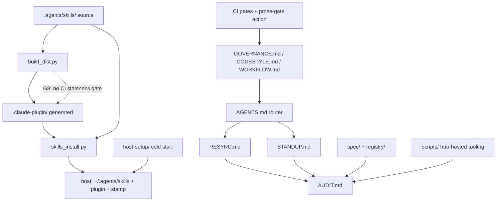
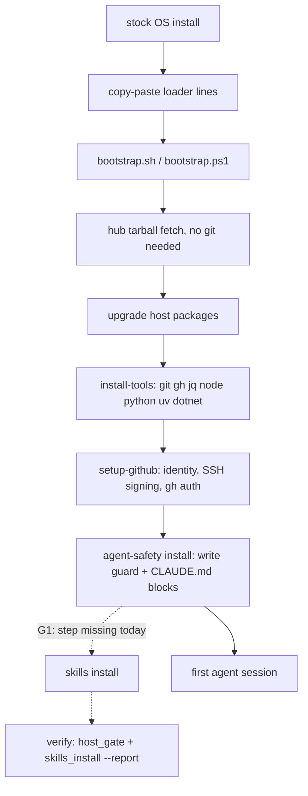
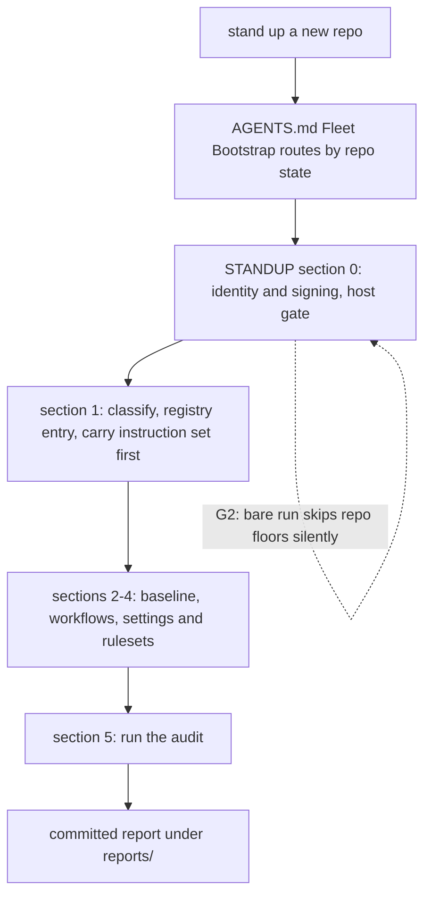
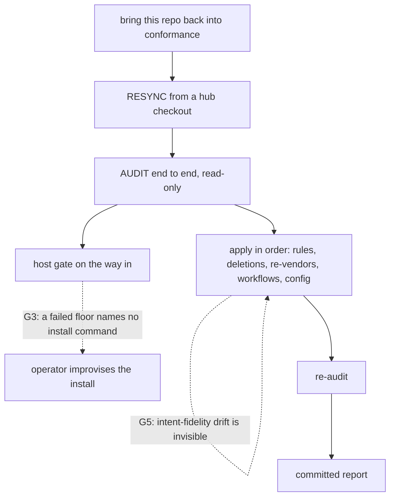
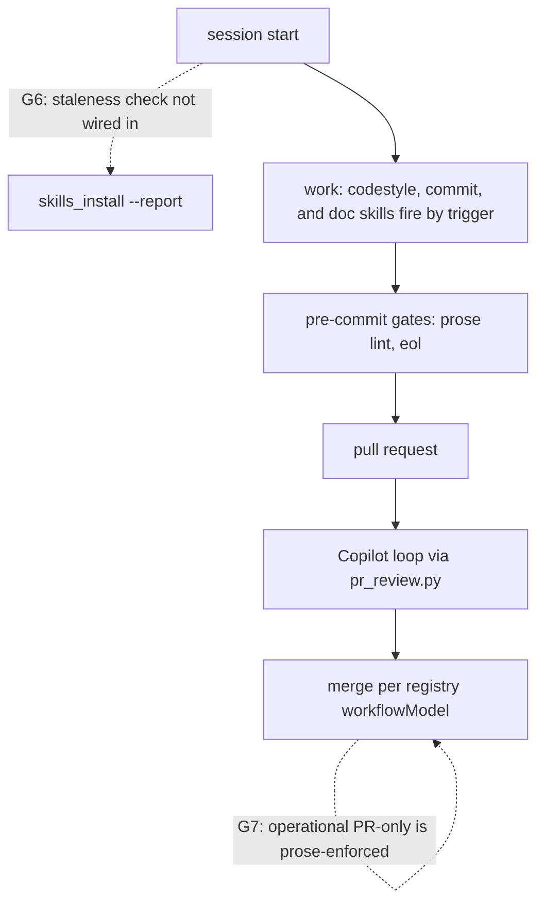
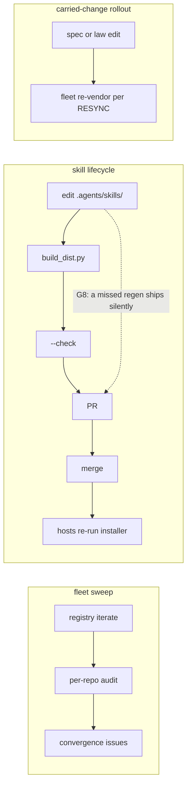
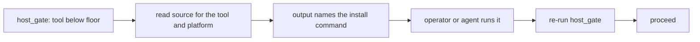

# Fleet Map and Gap Register (Hub-Only)

The **map** of how a human or an agent enters the fleet system, the **register** of the gaps and loose ends between its parts, and the roadmap that closes them. This doc is **hub-only** and is not carried downstream, because it describes the hub's own seams rather than a fact about any one repo. It is a map and never the procedure: [`AGENTS.md`][agents], [`STANDUP.md`][standup], [`RESYNC.md`][resync], and [`AUDIT.md`][audit] keep authority over their flows, and where this doc and a procedure doc disagree, the procedure doc wins and this map is what needs fixing.

**Maintenance rule.** A pull request that closes a register gap edits that gap's row and detail block in the same change, per [GOVERNANCE.md "Durable Knowledge and Self-Improvement"][governance-durable-knowledge]. A register describing a gap that is already closed is itself the staleness gap G4 describes, so the register is only trustworthy while this rule holds.

Every `Checked` evidence anchor below reads `develop` at `ba392f9` on 2026-08-13 unless it says otherwise.

## Table of Contents <!-- omit from toc -->

- [Scope and Non-Goals](#scope-and-non-goals)
- [System Map](#system-map)
- [Entry Points](#entry-points)
  - [Pre-Agent Cold Start](#pre-agent-cold-start)
  - [A New Repository](#a-new-repository)
  - [A Stale Repository](#a-stale-repository)
  - [Daily Development in a Conformant Repository](#daily-development-in-a-conformant-repository)
  - [Hub-Side Operations](#hub-side-operations)
- [Skills Install Model](#skills-install-model)
- [Gap Register](#gap-register)
- [Proposed Skills](#proposed-skills)
  - [audit-a-repo](#audit-a-repo)
  - [workflow-ci-contract](#workflow-ci-contract)
  - [skill-lifecycle](#skill-lifecycle)
  - [agent-conduct](#agent-conduct)
- [Peer Messaging](#peer-messaging)
- [Simplified Technical English Evaluation](#simplified-technical-english-evaluation)
- [Adoption and Operation Roadmap](#adoption-and-operation-roadmap)
  - [P0: This Pull Request](#p0-this-pull-request)
  - [P1: Close the Install Model](#p1-close-the-install-model)
  - [P2: Close the Skill Coverage](#p2-close-the-skill-coverage)
  - [P3: Audit-Depth Decisions](#p3-audit-depth-decisions)
  - [P4: Steady State](#p4-steady-state)
- [Decision Ledger Cross-References](#decision-ledger-cross-references)

## Scope and Non-Goals

This doc governs five things: the entry-point routing map, the gap register with a defined handoff per gap, the resolved skills install model, the proposals for new skills, and the phased roadmap. It does not author skills (each proposed skill ships through its own pull request via the [`.agents/skills/`][skills-readme] pipeline), does not restate any procedure, and treats multi-agent coordination as a documented pattern only, with the rules in [`docs/peer-messaging.md`][peer-messaging]. The version history that produced the current skill-based model is in [`HISTORY.md`][history], so this doc states only what is.

## System Map

The layers, one line each. The lifecycle docs route and procedure ([`AGENTS.md`][agents] routes, [`STANDUP.md`][standup] creates, [`RESYNC.md`][resync] re-lines, [`AUDIT.md`][audit] measures). The law docs hold the rules ([`GOVERNANCE.md`][governance] cross-cutting, [`CODESTYLE.md`][codestyle] per language, [`WORKFLOW.md`][workflow] the CI/CD contract). The machine ground truth is [`spec/`][files] plus [`registry/repos.json`][repos]. The hub-hosted tooling is [`scripts/`][scripts-readme], reached rather than carried. The skills source of truth is [`.agents/skills/`][skills-readme], and [`scripts/build_dist.py`][build-dist] generates the Claude Code plugin under [`.claude-plugin/`][marketplace] from it. [`scripts/skills_install.py`][skills-install] installs both forms per machine. [`host-setup/`][host-setup-doc] provisions a host from a stock OS. CI enforces the deterministic subset of the rules on every pull request.

## Entry Points

Five doors into the system. Each subsection names its flow, the docs that own it, and the register gaps that sit on its path. Solid arrows are the flow as built, dashed arrows mark a gap by its register ID.

### Pre-Agent Cold Start

A fresh OS install, no git, no agent. The operator copy-pastes the loader lines from [`host-setup/README.md`][host-setup-readme], and everything after that is scripted. No agent exists at this stage, so this path must work from prose and copy-paste alone.

Owned by [`host-setup/`][host-setup-readme] and [`docs/host-setup.md`][host-setup-doc]. Gaps on this path: G1 (the skills install has no home in the provisioning flow, so a fully bootstrapped host has every tool and no fleet skills).

### A New Repository

An agent is told to create or stand up a repo. The router of last resort is the byte-locked `Fleet Bootstrap` section of [`AGENTS.md`][agents], mirrored host-wide by the `CLAUDE.md` block the agent-safety installer deploys, so the routing reaches an agent even in a directory holding nothing.

Owned by [`STANDUP.md`][standup], packaged as the `standup-a-repo` skill. Gaps on this path: G2 (a bare `host_gate.py` run before the target's overlay exists reports nothing about the floors it skipped).

### A Stale Repository

The hub has moved and a downstream repo is behind. The agent runs [`RESYNC.md`][resync] from a hub checkout, which runs [`AUDIT.md`][audit] end to end and applies the findings in a load-bearing order.

Owned by [`RESYNC.md`][resync] and [`AUDIT.md`][audit], packaged as the `resync-a-repo` skill with the `carried-instruction-file-guard` and `copilot-instructions-keeper` skills firing inside it. Gaps on this path: G3 (the audit-to-install bridge), G4 (deletion sweeps miss prose), G5 (intent-fidelity drift detection).

### Daily Development in a Conformant Repository

The steady state. An agent writes Python, C#, shell, or config in a repo that already conforms, and the codestyle, commit, and review skills fire by trigger.

Owned by the per-language sections of [`CODESTYLE.md`][codestyle] and the conduct skills. Gaps on this path: G6 (nothing at session entry checks whether this machine's skills are stale), G7 (the operational develop ruleset blocks no direct commit).

### Hub-Side Operations

Work on the fleet itself, run from a hub checkout: sweeping the fleet for drift, changing a carried rule, and changing the skills.

Owned by [`AUDIT.md`][audit] section 10, [`GOVERNANCE.md` "Hub-Hosted Tooling"][governance-hub-hosted-tooling], and [`.agents/skills/README.md`][skills-readme]. Gaps on this path: G8 (no CI gate runs `build_dist.py --check`), G9 and G10 (topics and the skill lifecycle itself lack skills), G12 (conduct rules are scattered).

## Skills Install Model

**Resolved: the install is global per user, and the work is closing its gaps, not adding a second model.** A per-repo pinned install was considered and rejected: it would let a repo's skills match its own state, but it forfeits coverage of ad-hoc sessions in no repo at all (which is where the incidents this fleet guards against actually happened), doubles the staleness surface, and adds a version-resolution mechanism the fleet does not need while the whole fleet tracks one hub.

The lifecycle chain as built: a skill is hand-authored under [`.agents/skills/`][skills-readme], [`scripts/build_dist.py`][build-dist] generates the Claude Code plugin under [`.claude-plugin/`][marketplace], and [`scripts/skills_install.py`][skills-install] installs both forms per machine (an overlay copy into `~/.agents/skills/` for Codex and opencode, a user-scope plugin install for Claude Code), stamping the hub commit into `~/.agents/skills-install-stamp.json`. `skills_install.py --report` is the read-only staleness check and exits non-zero when the machine is behind the checkout.

Four wiring points close the model, each a register gap with its own deliverable:

1. **Bootstrap** (G1): [`host-setup/bootstrap.sh`][bootstrap] and [`bootstrap.ps1`][bootstrap-ps1] gain a skills step after the agent-safety install, degrading gracefully when the `claude` CLI is absent (the overlay half still lands, and the stamp records the partial install).
2. **Host contract** (G1): [`docs/host-setup.md`][host-setup-doc] gains a section stating the install and the verify command, and the [`README.md`][readme] "Using This Repo" section names the skills install as the fourth deployed thing.
3. **Session entry** (G6): the tail of [`AGENTS.md`][agents] already says a rule that keeps needing restating signals a stale install, and the `fleet-conformance-check` skill already runs the report, so the gap closes by stating the cadence in both places rather than by new tooling.
4. **Refresh cadence** (G6): re-run the installer when `--report` exits non-zero, and after any hub merge that touches `.agents/skills/`. The maintainer runs it by hand today, and an automated refresh is deliberately out of scope until the fleet has evidence the manual cadence fails.

## Gap Register

| ID | Gap | Owner | Phase |
| --- | --- | --- | --- |
| G1 | Skills install is absent from the cold-start flow | script + doc | P1 |
| G2 | Host-tools repo overlay is silently skippable | script + doc | P1 |
| G3 | A failed tool floor names no install remedy | spec + script | P1 |
| G4 | Deletion sweeps miss prose describing the deleted path | doc | P3 |
| G5 | Intent-fidelity carried files have no drift detection | spec + decision | P3 |
| G6 | Session entry never checks skill staleness | doc + skill | P1 |
| G7 | Operational develop PR-only rule is prose-enforced | decision | P3 |
| G8 | Generated plugin can ship stale with no CI gate | CI | P1 |
| G9 | WORKFLOW.md and AUDIT.md have no skill coverage | skill | P2 |
| G10 | The skill lifecycle itself has no skill | skill | P2 |
| G11 | Peer messaging is live but undeclared | doc | P0 |
| G12 | General conduct rules have no skill | skill | P2 |

Each gap's handoff below states who detects it, what closes it, and the test that proves it closed. The handoff sentence is the contract the closing pull request implements.

### G1: Skills Install Is Absent From the Cold Start

- **Gap** - A host bootstrapped end to end via `host-setup/` has every tool and no fleet skills, because no provisioning step runs [`scripts/skills_install.py`][skills-install].
- **Checked** - Zero matches for `skills_install` under `host-setup/`, and [`README.md`][readme] "Using This Repo" opens with "Three things are deployed from here".
- **Handoff** - When the bootstrap reaches the end of its host mode, it runs the skills installer from the fetched hub tree, and the verify step runs `skills_install.py --report` beside `host_gate.py`.
- **Closed when** - A fresh-host run per [`host-setup/README.md`][host-setup-readme] ends with the stamp present and `--report` exiting zero, and the README names four deployed things.
- **Target** - [`bootstrap.sh`][bootstrap] + [`bootstrap.ps1`][bootstrap-ps1] step, [`docs/host-setup.md`][host-setup-doc] section, [`README.md`][readme] edit. The closing PR decides how the step degrades when the `claude` CLI is absent, and whether that CLI joins [`spec/host-tools.json`][host-tools] as a cataloged tool.

### G2: Host-Tools Repo Overlay Is Silently Skippable

- **Gap** - [`scripts/host_gate.py`][host-gate] run without `--repo` checks only the fleet floors, and reports nothing about the target-repo overlay floors it skipped. [`STANDUP.md`][standup] section 0 works around this in prose.
- **Checked** - STANDUP section 0 states a bare run "reports nothing about the omission".
- **Handoff** - When `host_gate.py` runs bare while the working directory is inside a repo carrying a `host-tools.json` overlay, it says so in its output, naming the `--repo` re-run that would count the overlay.
- **Closed when** - A bare run inside such a repo prints the warning, and the STANDUP prose can drop the workaround sentence.
- **Target** - `host_gate.py` warning, [`STANDUP.md`][standup] section 0 wording.

### G3: A Failed Tool Floor Names No Install Remedy

- **Gap** - The tool catalog detects a missing or stale tool, and the handoff back into `host-setup/` does not exist: a failed floor leaves the operator or agent to rediscover which installer provides the tool.
- **Checked** - `host_gate.py` output names the tool and the floor, and no output names an install command. Each [`spec/host-tools.json`][host-tools] entry carries a per-platform `source` already.
- **Handoff** - When `host_gate.py` reports a tool below its floor, its output names the command that installs or upgrades that tool on the current platform, derived from the catalog's `source` field, so the failure carries its own remedy.

- **Closed when** - Every required tool's failure output names a runnable remedy, and [`scripts/test_bootstrap.py`][scripts-readme] asserts the mapping stays total.
- **Target** - [`spec/host-tools.json`][host-tools] remedy mapping (or a derivation from `source`), `host_gate.py` output, test coverage.

### G4: Deletion Sweeps Miss Prose

- **Gap** - A resync that deletes a carried file greps for the path and finds code uses, not prose describing the file without naming its path. A measured incident left a layout section describing a deleted script.
- **Checked** - [`RESYNC.md`][resync] section 4 documents the incident and prescribes the manual remedy.
- **Handoff** - When a resync deletes a file, the session reads the files whose job is to describe what the repo holds (the layout and operations sections) before shipping, per the RESYNC section 4 step.
- **Closed when** - Either the manual step is judged sufficient and this row closes as `accepted`, or a lint that flags a stale description ships and the row names it.
- **Target** - Decision first, optional [`scripts/prose_lint.py`][scripts-readme] check second.

### G5: Intent-Fidelity Drift Is Invisible

- **Gap** - A carried file at `intent` fidelity is presence-checked only, so it can trail the hub by many revisions while the audit reads clean. This class hid real drift before.
- **Checked** - [`RESYNC.md`][resync] section 5 names the class, and [`spec/fidelity_honesty.py`][fidelity-model] finds promotion candidates but runs only when the owner runs it.
- **Handoff** - When the audit reports on a repo, it also reports the hub revision each intent-fidelity unit was last reconciled against, advisory rather than failing, so staleness is at least visible.
- **Closed when** - Either the advisory surfaces in the audit report, or the row closes as `accepted` with the honest statement standing in [`AUDIT.md`][audit] and [`spec/fidelity-model.md`][fidelity-model].
- **Target** - Decision, then candidate advisory in `spec/audit.py`.

### G6: Session Entry Never Checks Skill Staleness

- **Gap** - A machine with stale or missing skills behaves like a machine that never installed them, and nothing at session entry says so. The symptom is a rule that keeps needing to be restated.
- **Checked** - [`AGENTS.md`][agents] names the symptom in its closing paragraph, and the `fleet-conformance-check` skill runs the report, but only when invoked.
- **Handoff** - When a session starts work in a fleet repo, the documented cadence directs it to run `skills_install.py --report` from a hub checkout on suspicion, and the `fleet-conformance-check` skill is the trigger surface.
- **Closed when** - The cadence is stated in [`docs/host-setup.md`][host-setup-doc] and the skill's own text, and the restated-rule symptom routes to the check in both.
- **Target** - Doc wording, `fleet-conformance-check` skill text.

### G7: Operational Develop PR-Only Is Prose-Enforced

- **Gap** - [`repo-config/operational/develop.json`][repo-config-readme] carries deletion, non-fast-forward, and signature rules only, so nothing blocks a direct commit that skips the feature-branch instruction during a standup.
- **Checked** - The ruleset payload, and [`WORKFLOW.md`][workflow] "Branch Model", which documents the direct-commit allowance as deliberate for the operational model.
- **Handoff** - This is a decision row: the allowance is the model's foundation, so the candidate outcomes are `accepted` (the standup instruction stays prose-enforced) or a standup-time-only tightening. Nothing detects the violation mechanically today.
- **Closed when** - The maintainer records the disposition, mirroring the [`spec/divergences.json`][divergences] vocabulary.
- **Target** - A disposition, not necessarily code.

### G8: Generated Plugin Can Ship Stale

- **Gap** - `.claude-plugin/` is generated from `.agents/skills/`, and a merge that edits the source without re-running [`scripts/build_dist.py`][build-dist] ships a plugin that no longer matches it. `--check` exists and nothing in CI runs it.
- **Checked** - [`.github/workflows/validate-task.yml`][validate-task] runs markdownlint, cspell, JSON validation, and actionlint, and does not run `build_dist.py --check`.
- **Handoff** - When a pull request touches `.agents/skills/` or `.claude-plugin/`, CI runs `build_dist.py --check` and the aggregator gates on it.
- **Closed when** - A PR desyncing the two trees fails the required check.
- **Target** - A step in [`validate-task.yml`][validate-task].

### G9: WORKFLOW.md and AUDIT.md Have No Skill

- **Gap** - The largest law doc ([`WORKFLOW.md`][workflow], the D1-D9 contract) and the measurement procedure ([`AUDIT.md`][audit]) have no skill surface, while every other procedure and language does. Thirteen [`GOVERNANCE.md`][governance] sections are likewise doc-only.
- **Checked** - The [`AGENTS.md`][agents] rule map annotates no skill on those rows, and no skill under `.agents/skills/` names either doc.
- **Handoff** - The `workflow-ci-contract` and `audit-a-repo` proposals below package the two docs. Each remaining doc-only GOVERNANCE section gets an explicit disposition, skill or no-skill-needed, so absence is a decision rather than an oversight.
- **Closed when** - Both skills ship, and the rule map carries a disposition per section.
- **Target** - Two skills, one rule-map sweep.

### G10: The Skill Lifecycle Has No Skill

- **Gap** - Authoring, changing, and retiring a skill is governed by scripts and scattered prose, so the agent most likely to get it wrong (one editing a skill) has no skill watching it.
- **Checked** - No skill under `.agents/skills/` covers editing `.agents/skills/`, and the regen and install semantics live in [`.agents/skills/README.md`][skills-readme] and `scripts/` docstrings.
- **Handoff** - The `skill-lifecycle` proposal below packages the pipeline, and it ships first in phase 2 so the other three proposals are authored under it.
- **Closed when** - The skill ships and the README defers to it for procedure.
- **Target** - One skill.

### G11: Peer Messaging Is Live but Undeclared

- **Gap** - Agent-to-agent messaging works and has produced real findings, and no committed doc states its rules, so each session rediscovers the capability without its boundaries.
- **Checked** - [`TODO.md`][todo] "Peer Messaging Between Agents as a Declared Method", with the live exchange anchored there at `develop` `3855dbb` on 2026-08-10.
- **Handoff** - [`docs/peer-messaging.md`][peer-messaging] declares the method and its safety rules, hub-only, and the TODO item's open location question resolves to it.
- **Closed when** - This pull request merges. This row closes in P0.
- **Target** - [`docs/peer-messaging.md`][peer-messaging], shipped beside this doc.

### G12: General Conduct Rules Have No Skill

- **Gap** - The conduct layer (ask when unsure, never assume, verification before claiming done, delegation and token discipline) lives in carried [`AGENTS.md`][agents] sections and doc-only GOVERNANCE sections, with no skill firing at the moments those rules are violated.
- **Checked** - The rule map rows for `Verification Discipline` and `Communicating with the User` carry no skill annotation.
- **Handoff** - The `agent-conduct` proposal below packages the decision-moment triggers, and the carried AGENTS.md sections stay the always-on layer.
- **Closed when** - The skill ships with narrow triggers, per the proposal.
- **Target** - One skill.

## Proposed Skills

Four skills close G9, G10, and G12. Each ships as its own pull request through the [`.agents/skills/`][skills-readme] pipeline, authored under the `skill-lifecycle` skill once it exists, which is why that one goes first. Scope and overlap are settled here so the authoring PRs implement rather than re-litigate.

### audit-a-repo

- **Scope** - Read-only measurement of a named repo ending in a committed report: the [`AUDIT.md`][audit] flow, the verdict taxonomy, what the deterministic runner covers and what stays hand-judged, and the rule that measuring never edits.
- **Trigger** - Asked to audit, measure, or verify conformance of a named repo, or to judge a conformance claim.
- **Packages** - [`AUDIT.md`][audit], which keeps authority.
- **Overlap** - Completes the triangle: `standup-a-repo` creates, `resync-a-repo` applies, and this measures. `fleet-conformance-check` stays the in-repo self-check with no named target. Each description disambiguates against the others, in the style the existing three already use.

### workflow-ci-contract

- **Scope** - The [`WORKFLOW.md`][workflow] behavioral contract: the D-guarantees, the seam contract, artifact lifecycle, NBGV versioning, validate-at-entry, and the per-type walkthroughs as references.
- **Trigger** - Writing or editing workflow YAML, adding or dropping a release target, or reasoning about why a publish did or did not fire.
- **Packages** - The YAML half of the pipeline. `operational-vs-release-workflow` keeps the git half (branching, promotion, publish policy), and the two descriptions state the split.
- **Overlap** - The source doc is large, so the skill is a summary plus binding rules with `references/` splits, the shape `comment-and-doc-style` already uses.

### skill-lifecycle

- **Scope** - Creating, changing, splitting, and retiring a skill: the source-vs-generated split, the regen and `--check` semantics of [`scripts/build_dist.py`][build-dist], the install and stamp semantics of [`scripts/skills_install.py`][skills-install], the doc-packaging pattern (summary in the law doc, full rules in the skill), and trigger-description conventions.
- **Trigger** - About to create or edit anything under `.agents/skills/` or `.claude-plugin/`.
- **Packages** - [`.agents/skills/README.md`][skills-readme] procedure content, which then defers to it.
- **Overlap** - None today, which is gap G10. Adjacent to `comment-and-doc-style` for SKILL.md prose only.

### agent-conduct

- **Scope** - The conduct rules with no skill surface: verification before claiming done, asking instead of assuming, recording a lesson when a failure surfaces one, and the delegation summary.
- **Trigger** - **Narrow, at decision moments**: about to claim work is done without having verified it, about to proceed on an assumption the user could cheaply confirm, or a failure just surfaced a durable lesson. Deliberately not always-on: the carried [`AGENTS.md`][agents] sections are the always-on layer, and an always-on conduct skill would duplicate them and spend the tokens the delegation rules exist to save.
- **Packages** - `Verification Discipline`, `Communicating with the User`, and `Durable Knowledge and Self-Improvement` from [`GOVERNANCE.md`][governance], which keep authority.
- **Overlap** - The commit, review, and doc skills each carry their own conduct rules already, and this skill points rather than restates where one of those owns the moment.

## Peer Messaging

Agent-to-agent messaging on one host is a working method with measured value, and its rules are declared in [`docs/peer-messaging.md`][peer-messaging]. The location decision from the [`TODO.md`][todo] item resolves to a hub-only doc first: the rules bind sessions on the maintainer's own hosts today, the transport cannot cross a machine boundary, and a carried GOVERNANCE section costs a fleet re-vendor for rules whose cross-host half is unverified. Promotion to a carried section or a skill is re-evaluated when cross-host messaging is verified or a downstream session demonstrably needed the rules and lacked them.

## Simplified Technical English Evaluation

Should agent-authored prose adopt ASD-STE100, a controlled language standard, or a lighter constrained house style? The criteria: does it improve agent instruction-following, does it compose with the enforcement that exists ([`scripts/prose_lint.py`][scripts-readme] and the character-set and semicolon rules), what does it cost to author, and does its vocabulary fit a technical fleet.

| Criterion | Full ASD-STE100 | Constrained house style |
| --- | --- | --- |
| Instruction-following | One-instruction-per-sentence and active voice measurably help | The same two properties, adoptable directly |
| Enforcement fit | The controlled dictionary is not lintable by the existing tooling | Each rule lands as a `prose_lint.py` check like the current ones |
| Authoring cost | Approved-word lookup on every sentence, for every author and agent | Marginal on top of the rules already enforced |
| Vocabulary | The approved general-word list excludes ordinary technical usage this fleet needs | Unrestricted vocabulary, restricted structure |

**Recommendation**: adopt the structural half as house style (short sentences, one instruction per sentence, active voice, imperative mood for procedure steps), codified incrementally as `prose_lint.py` checks, and do not adopt the controlled dictionary. The existing rules already lean this way, so this is a direction confirmed rather than a new regime. The maintainer decides on this doc's pull request, and the decision lands in `GOVERNANCE.md` "Documentation Style Conventions" whenever the first structural check ships.

## Adoption and Operation Roadmap

Design-doc first: this doc merges, then each unchecked item becomes an issue linking its register row, and the closing pull request edits the row per the maintenance rule.

### P0: This Pull Request

- [x] Fleet map and gap register committed (this doc)
- [x] Peer messaging declared ([`docs/peer-messaging.md`][peer-messaging], closes G11)
- [x] [`TODO.md`][todo] peer-messaging item resolved by pointer

### P1: Close the Install Model

- [ ] G1 bootstrap skills step, host-setup section, README fourth deployed thing (cross-links the open host-tooling issues [#671][issue-671] and [#673][issue-673], which touch the same scripts)
- [ ] G2 `host_gate.py` bare-run warning
- [ ] G3 failed-floor remedy output
- [ ] G6 staleness cadence wording
- [ ] G8 `build_dist.py --check` in CI

### P2: Close the Skill Coverage

- [ ] G10 `skill-lifecycle` skill, authored first
- [ ] G9 `audit-a-repo` skill
- [ ] G9 `workflow-ci-contract` skill
- [ ] G12 `agent-conduct` skill
- [ ] G9 disposition sweep over the doc-only GOVERNANCE sections in the [`AGENTS.md`][agents] rule map

### P3: Audit-Depth Decisions

- [ ] G4 disposition: manual step sufficient, or a lint ships
- [ ] G5 disposition: advisory staleness in the audit report, or accepted
- [ ] G7 disposition: operational standup enforcement, or accepted

### P4: Steady State

- [ ] Refresh cadence observed in practice, revisited if the manual cadence fails
- [ ] Register rows retired as they close, per the maintenance rule
- [ ] Peer-messaging promotion re-evaluated after cross-host verification
- [ ] STE structural checks land in `prose_lint.py` incrementally, if adopted

## Decision Ledger Cross-References

[`TODO.md`][todo] stays the running backlog, and this register does not fork it. The peer-messaging item resolves to [`docs/peer-messaging.md`][peer-messaging] and section G11. The host-tooling cluster ([#671][issue-671], [#672][issue-672], [#673][issue-673]) touches the same `host-setup/` surface as G1 and G3, so those issues and the P1 items cross-link rather than duplicate. A future TODO entry about an adoption gap lands as a register row here instead, with TODO carrying only the pointer.

<!-- Repo -->

[agents]: ../AGENTS.md
[audit]: ../AUDIT.md
[bootstrap]: ../host-setup/bootstrap.sh
[bootstrap-ps1]: ../host-setup/bootstrap.ps1
[build-dist]: ../scripts/build_dist.py
[codestyle]: ../CODESTYLE.md
[divergences]: ../spec/divergences.json
[fidelity-model]: ../spec/fidelity-model.md
[files]: ../spec/files.json
[governance]: ../GOVERNANCE.md
[governance-durable-knowledge]: ../GOVERNANCE.md#durable-knowledge-and-self-improvement
[governance-hub-hosted-tooling]: ../GOVERNANCE.md#hub-hosted-tooling
[history]: ../HISTORY.md
[host-gate]: ../scripts/host_gate.py
[host-setup-doc]: ./host-setup.md
[host-setup-readme]: ../host-setup/README.md
[host-tools]: ../spec/host-tools.json
[marketplace]: ../.claude-plugin/marketplace.json
[peer-messaging]: ./peer-messaging.md
[readme]: ../README.md
[repo-config-readme]: ../repo-config/README.md
[repos]: ../registry/repos.json
[resync]: ../RESYNC.md
[scripts-readme]: ../scripts/README.md
[skills-install]: ../scripts/skills_install.py
[skills-readme]: ../.agents/skills/README.md
[standup]: ../STANDUP.md
[todo]: ../TODO.md
[validate-task]: ../.github/workflows/validate-task.yml
[workflow]: ../WORKFLOW.md

<!-- Issues -->

[issue-671]: https://github.com/ptr727/ProjectTemplate/issues/671
[issue-672]: https://github.com/ptr727/ProjectTemplate/issues/672
[issue-673]: https://github.com/ptr727/ProjectTemplate/issues/673
