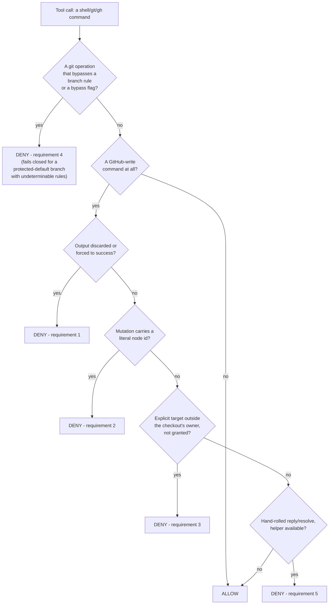
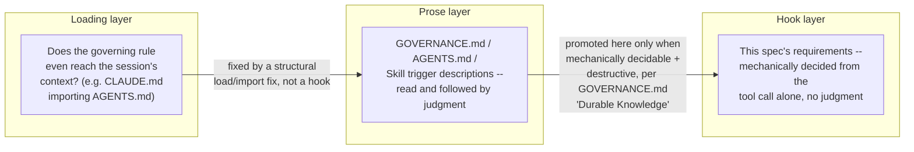

# Agent Write-Safety Spec

What any coding agent must be stopped from doing when it runs on this host with the maintainer's
`gh` credentials, stated once, independent of which agent implements it. This file is the source
of truth: an implementation is built from the requirements below, and an implementation is audited
by checking its decisions against them, not by reading its source as the implicit spec.

## Why This Exists

A mis-targeted GitHub write acts publicly under the maintainer's identity: a fabricated node id
once posted a stray comment, as the maintainer, to a stranger's repository. A mutating git command
run directly in a primary checkout destroys another task's uncommitted work without ever reaching
GitHub. Both incidents happened under prose rules the agent had already read. Neither was fixed by
writing the rule more clearly. [`GOVERNANCE.md`][governance] "Durable Knowledge and Self-Improvement"
states the general criteria for when a rule like this earns a mechanical hook instead of staying
prose. The requirements below are the write-safety instance of that criteria, applied.

## Requirements

Each requirement is stated as a decision rule, precise enough to implement against any agent's own
hook or approval-gate API, not tied to Claude Code's `PreToolUse` JSON shape.

1. **A GitHub write with its output discarded or forced to success is denied.** A state-changing
   `gh`/API call piped to `>/dev/null`, `2>/dev/null`, `&>/dev/null`, `|| true`, `|| :`, or `|| echo`
   hides the one signal that tells a client-reported failure apart from a server-side success. Deny
   the write, then allow it once run so its real result is read.
2. **A GraphQL mutation carrying a literal GitHub node id is denied. A captured variable is
   trusted.** Node ids resolve globally, so a fabricated, stale, or hand-typed id can land on a real
   object in a different repository. A `-F name="$VAR"` value captured from a live query in the same
   session is allowed. A literal id in the same position, such as one prefixed `PR_`, `PRRT_`,
   `IC_`, or `BOT_` (an uppercase-letter prefix followed by an underscore and a long body, or the
   legacy `MD`-prefixed base64 form), is denied.
3. **A GitHub write with an explicit target outside the checkout's own owner is denied, unless the
   maintainer granted it.** Compare the write's explicit `-R`/`--repo`/`repos/<owner>/<repo>` target
   against the checkout's own `origin` owner. A sibling repository under the same owner is allowed
   with no grant, since the harm this guards is reaching a stranger's repository, not working across
   one maintainer's own fleet. A different owner is allowed only when named in a grant read from the
   environment the session was launched with -- never a channel the agent itself can set (an inline
   `VAR=x cmd` prefix or an `export` inside the same call must not satisfy this).
4. **A git operation that would only succeed by bypassing an active branch rule is denied**: a
   direct push to a branch whose rules require a pull request, a force-push where history is
   protected, a delete where deletion is blocked, or an explicit-bypass flag (`--admin` on a merge,
   `--no-verify` on a commit/push). Judge branch-rule cases against that branch's *live* rules, so a
   code-style `develop` denies and a config-style `develop` allows with no per-repo configuration.
   **This one fails closed, but only for a branch protected by default** (`main`, `master`,
   `develop`): when that branch's rules cannot be determined at all (network unreachable, origin
   unresolvable), deny rather than allow, because the harm is a silent success under the
   maintainer's own admin bypass. A push to any other branch whose rules cannot be determined
   passes this requirement instead, since there is nothing yet on record to bypass. Every other
   requirement here favors precision over recall throughout, denying only a positively-identified
   dangerous shape, since a hook that fails closed on an unrelated resolution failure blocks
   legitimate work far more often than it catches a real bypass.
5. **A hand-rolled reply or resolve on a review thread, bypassing the one-call helper, is denied
   (where a helper exists) or flagged.** Splitting a reply and a resolve into two separate hand-run
   API calls is what let a reply sit unresolved across a push, reading as untriaged. Where the agent's
   fleet ships a single documented helper for this (this repo's `scripts/pr_review.py reply --resolve`),
   a raw mutation reaching the same endpoint is denied in favor of it.

**Not yet implemented anywhere, tracked at [issue #1073][issue-1073]:** a mutating git operation run
directly against a primary (non-worktree) checkout should be denied the same way. This spec is
updated with that requirement's exact decision rule in the same change that adds it to the Claude
Code hook, so a reader here always sees what is actually enforced, not what is merely planned.

## Decision Flow

The first diagram is this spec's actual decision flow, generalized from `claude/gh-write-guard.py`'s
`classify()`. The second is why a failure lands in one layer and not another. A rule that never
reached the session at all is a loading bug, fixed the way PR #1081 fixed `local-strict-review`'s
missed trigger, by wiring `CLAUDE.md` to import `AGENTS.md`. A rule that reached the session and
was still not followed, where the trigger is mechanically decidable and the harm is destructive,
is promoted to a hook ([issue #1073][issue-1073]'s primary-checkout guard, above, is the worked
example once it lands). A rule whose violation can only be judged, not mechanically decided (was a
review finding actually evidence-backed?), stays prose and a chained Skill trigger, since a hook
there could only nag, never decide.

## Per-Agent Status

| Agent | Status | Implementation |
| --- | --- | --- |
| Claude Code | Requirements 1-5, via a `PreToolUse` hook | [`claude/README.md`][claude] |
| Codex | No hook yet -- tracked at [issue #781][issue-781] | [`codex/README.md`][codex] |
| opencode | No hook yet -- tracked at [issue #781][issue-781] | [`opencode/README.md`][opencode] |

GitHub Copilot carries no subdirectory here: it reviews through GitHub's own hosted infrastructure
rather than running local shell commands under the maintainer's credentials, so it has no analogous
local write-safety hazard for this kit to cover.

## Auditing an Implementation Against This Spec

Run the implementation's own self-test (`claude/gh-write-guard.py --selftest` for Claude Code) and
compare every case against the requirements list above, one by one, rather than reading the
implementation's source as though it were the spec. A case the self-test doesn't cover is a gap in
the audit, not evidence the requirement is satisfied. This is the concrete shape of "ask Claude to
audit the Claude hooks against the spec" or "ask Codex to implement Codex's own hooks against the
spec": point the agent at this file's requirements, not at another agent's source code.

<!-- Repo -->
[claude]: ./claude/README.md
[codex]: ./codex/README.md
[opencode]: ./opencode/README.md
[governance]: ../../GOVERNANCE.md
[issue-781]: https://github.com/ptr727/ProjectTemplate/issues/781
[issue-1073]: https://github.com/ptr727/ProjectTemplate/issues/1073
