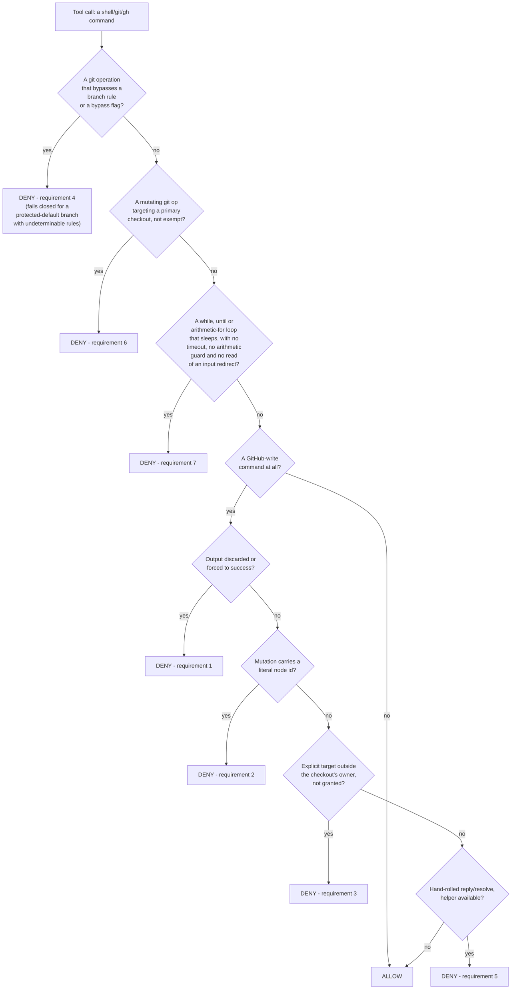
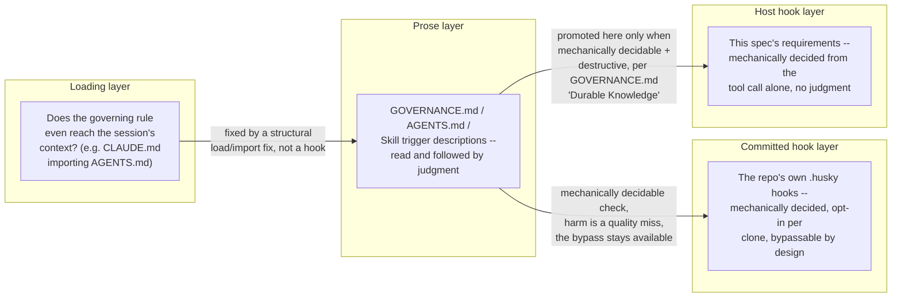

# Agent Host-Safety Spec

What any coding agent must be stopped from doing when it runs unattended on this host, stated once,
independent of which agent implements it. Most of it guards the maintainer's `gh` credentials, which
is where the harm started. Requirements 7 to 9 guard the machine itself, which is the other thing
an unattended agent takes down. This file is the source
of truth: an implementation is built from the requirements below, and an implementation is audited
by checking its decisions against them, not by reading its source as the implicit spec.

## Why This Exists

A mis-targeted GitHub write acts publicly under the maintainer's identity: a fabricated node id
once posted a stray comment, as the maintainer, to a stranger's repository. A mutating git command
run directly in a primary checkout destroys another task's uncommitted work without ever reaching
GitHub. An unbounded shell wait outlives every agent in the run that wrote it, and a machine carrying
enough of them has to be rebooted. All three incidents happened under prose rules the agent had
already read. None was fixed by writing the rule more clearly. [`GOVERNANCE.md`][governance] "Durable Knowledge and Self-Improvement"
states the general criteria for when a rule like this earns a mechanical hook instead of staying
prose. The requirements below are that criteria applied to this host.

## Requirements

Each requirement is stated as a decision rule, precise enough to implement against any agent's own
hook or approval-gate API, not tied to Claude Code's `PreToolUse` JSON shape. Requirement 8 is
stated against the end of a session rather than against a tool call, because what it covers has
already happened by the time any tool call is judged. Requirement 9 bounds every command whatever its
text says, because the harm it covers was never in the text.

1. **A GitHub write with its output discarded or forced to success is denied.** A state-changing
   `gh`/API call piped to `>/dev/null`, `2>/dev/null`, `&>/dev/null`, `|| true`, `|| :`, or `|| echo`
   hides the one signal that tells a client-reported failure apart from a server-side success. Deny
   the write, then allow it once run so its real result is read.
2. **A GraphQL mutation carrying a literal GitHub node id is denied.** Node ids resolve globally,
   so a fabricated, stale, or hand-typed id can land on a real object in a different repository. A
   literal id, such as one prefixed `PR_`, `PRRT_`, `IC_`, or `BOT_` (an uppercase-letter prefix
   followed by an underscore and a long body, or the legacy `MD`-prefixed base64 form), is denied. A
   `-F name="$VAR"` value in the same position is allowed instead of being pattern-matched, **not**
   because the hook has verified where `$VAR`'s value came from -- a static, pre-execution hook
   cannot see a shell variable's runtime binding, only the command text -- but because this rule's
   job is to catch the literal-id mistake specifically, and a captured-variable convention is what
   the fleet's own prose rule (`GOVERNANCE.md` "Repository Boundaries and Write Safety") requires
   agent behavior to uphold. Enforcing that the value genuinely came from a live query is
   behavioral, not something this decidable-from-text-alone rule can check.
3. **A GitHub write with an explicit target outside the checkout's own owner is denied, unless the
   maintainer granted it.** Compare the write's explicit `-R`/`--repo`/`repos/<owner>/<repo>` target
   against the checkout's own `origin` owner, when an `origin` resolves at all. A sibling repository
   under the same owner is allowed with no grant, since the harm this guards is reaching a
   stranger's repository, not working across one maintainer's own fleet. A different owner is
   allowed only when named in a grant read from the environment the session was launched with --
   never a channel the agent itself can set (an inline `VAR=x cmd` prefix or an `export` inside the
   same call must not satisfy this). **When no `origin` resolves at all** (a non-git directory, or a
   checkout whose remote can't be read), this requirement has nothing to compare the target against
   and does not fire -- requirements 1 and 2 still apply regardless, and this is the same
   precision-over-recall stance every requirement but 4 takes.
4. **A git operation that would only succeed by bypassing an active branch rule is denied**: a
   direct push to a branch whose rules require a pull request, a force-push where history is
   protected, a delete where deletion is blocked, or an explicit-bypass flag (`--admin` on a merge,
   `--no-verify` on a commit/push). Judge branch-rule cases against that branch's *live* rules, so a
   code-style `develop` denies and a config-style `develop` allows with no per-repo configuration.
   **This one fails closed, but only for a branch protected by default** (`main`, `master`,
   `develop`): when that branch's rules cannot be determined at all (network unreachable, origin
   unresolvable), deny rather than allow, because the harm is a silent success under the
   maintainer's own admin bypass. A push to any other branch whose rules cannot be determined
   passes this requirement instead, since there is nothing yet on record to bypass. Every other
   requirement here favors precision over recall throughout, denying only a positively-identified
   dangerous shape, since a hook that fails closed on an unrelated resolution failure blocks
   legitimate work far more often than it catches a real bypass.
5. **A hand-rolled reply or resolve on a review thread, bypassing the one-call helper, is denied
   (where a helper exists) unless the maintainer's cross-owner grant already covers it.** Splitting
   a reply and a resolve into two separate hand-run API calls is what let a reply sit unresolved
   across a push, reading as untriaged. Where the agent's fleet ships a single documented helper for
   this (this repo's `scripts/pr_review.py reply --resolve`), a raw mutation reaching the same
   endpoint is denied in favor of it. The one exception is a target the maintainer has already
   granted this session: the helper itself refuses a cross-owner pull request outright, so the
   hand-run form is then the documented fallback for that specific repository, and this is allowed
   through the same grant channel requirement 3 reads rather than a separate one. A REST reply's own
   URL can be checked against the grant. A `resolveReviewThread` mutation's thread id is opaque, so
   any active grant is the only signal available there, a coarser check than a REST reply gets and a
   residual gap this requirement accepts rather than blocking every grant-holding session's replies
   on an unrelated target.

6. **A mutating git operation run directly against a primary checkout is denied.** "Primary" means
   not a linked worktree. The decidable test is a comparison, not a filesystem-shape guess: `git
   rev-parse --path-format=absolute --git-dir --git-common-dir` returns equal paths for a primary
   checkout and unequal paths for a linked worktree. A `.git`-is-a-directory heuristic is wrong (a
   submodule's `.git` is a file yet is still a primary working tree that can lose uncommitted
   work). Deny `checkout`/`switch`/`pull`/`reset`/`rebase`/`merge`/`cherry-pick`/`revert`/`restore`/
   `stash` (anything but `list`/`show`)/`clean -f|-fd`/`add`/`commit`/`rm`/`mv`/`apply`/`am`/`push`/
   `worktree remove -f|--force` there. `push` is denied unconditionally too, even though it does
   not mutate the local working tree or HEAD the way the rest of this list does: no documented
   fleet workflow ever pushes from a primary checkout, every push runs from a task's own worktree,
   and rule 4's own branch-rule checks already run before this rule and can deny a push on their
   own separate grounds regardless. `clean` is exempt when `-n`/`--dry-run` is given before any
   `--` (bundled or not, e.g. `-nfd`, since a `-n` after `--` is an unconditional pathspec instead
   naming a real file, confirmed live), and confirmed live to always win over `-f`/`--force`
   regardless of order or repetition: it deletes nothing, only previews what a later, real forced
   clean would remove, so denying it adds no safety. A `checkout`/`switch`
   force flag (`-b`/`-B` for checkout,
   `-c`/`-C`/`--create`/`--force-create` for switch, `-f`/`--force`/`--discard-changes`/`--orphan`
   for either -- switch has no `-b`/`-B` and checkout has no `-c`/`-C`, confirmed against each
   subcommand's own `-h` output, so neither letter pair collides with an unrelated flag on the
   other) is recognized bundled into a short-option cluster or attached to its own value with no
   space (`-qf`, `-Bname`, `-Cother`), not only as an exact argv token -- an exact-token check
   alone lets `-qf`/`-Bname` reach the ref-switch exemption below while still forcing the checkout
   through, and would equally have let `switch -C <existing-branch>` through, confirmed live to
   reset that branch to the current HEAD with no dirty-tree warning at all, since it is not a
   working-tree overwrite. A `worktree remove`'s own `-f` is bundled the same way, since `remove`
   has no other short option `-f` could combine with: git requires `-f` given twice to remove a
   locked worktree, and the bundled `-ff` spelling satisfies that exactly as `-f -f` does,
   confirmed live to forcibly remove a locked worktree's uncommitted content. Allow
   `worktree add|list|prune`, a plain `worktree remove` with no force flag, any read, `merge
   --ff-only`/`pull --ff-only` (git's
   own semantics mean neither can discard anything), a bare `-` as a `checkout`/`switch` argument
   (porcelain shorthand for the previous branch, which only those two subcommands themselves
   understand, so it is exempt outright rather than checked), and a `checkout <ref>`/`switch <ref>`
   carrying no force flag whose argument verifiably resolves as a ref -- checked live (`git rev-parse
   --verify --quiet <ref>^{commit}`), since git's own ref-switch path refuses to overwrite a local
   modification but its pathspec-restore fallback for an argument that does not resolve as a ref
   (`git checkout .`, `checkout -- <path>`, `checkout <ref> -- <path>`, more than one bare
   positional) carries no such check and is denied. A non-force flag alongside the ref, such as
   `--detach`/`-q`, stays exempt too -- verified live, it changes nothing about git's own
   overwrite-refusal, so this is a real-ref-with-no-force-flag test, not a strictly zero-flags one,
   despite reading as "flagless" at a glance. These exemptions are the normal, documented way an
   agent uses a primary checkout as a fetch source and returns it to a base branch afterward, and
   denying them adds no safety while breaking routine, correct work. The ref-checkout exemption is a
   deliberate, validated scope boundary worth naming explicitly: the incident behind this requirement
   (#1073) ran exactly this shape (an unforced `checkout` then an `--ff-only` pull), so this
   requirement does not deny that incident's own literal commands. The concurrent-access hazard those
   commands still carried either way -- switching HEAD or fast-forwarding a checkout another task
   might be relying on, whether or not the working tree was dirty -- is not decidable from the
   command text alone, so it stays the prose rule's job (`GOVERNANCE.md` "Repository Boundaries and
   Write Safety", `repo-worktree`), not this one's.

   A subcommand name this requirement does not otherwise recognize is resolved through a chain of
   git aliases before being allowed to fall through -- an inline `-c alias.<name>=<value>` override
   on the same invocation first, then the target checkout's own persisted config (`git config --get
   alias.<name>`), matching real git's own override order, up to a bounded number of hops -- so a
   custom alias that expands to a denied builtin (`git -c alias.wipe='reset --hard' wipe`, or the
   same `wipe` alias persisted in the checkout's own config) is denied exactly as the builtin itself
   would be. A `!`-prefixed alias hands git an arbitrary shell string rather than naming another git
   subcommand, and this requirement does not and cannot safely interpret one, so it denies that
   shape outright against a primary checkout, the one place this requirement departs from its own
   fail-open stance, because the alias definition itself is concrete evidence of an attempt to run
   something via git in exactly the directory this requirement protects.

   Resolve the target directory the way real git itself does, not by a last-option-wins scan across
   every directory-naming option: any `-C <dir>` options on the invocation compose sequentially (an
   absolute value replaces the running directory outright, a relative one joins onto the previous
   result) onto a leading `cd <dir> &&`/`cd <dir> ;` prefix on the same command -- read inside a
   `sh -c`/`bash -c` wrapper too, and inherited from an outer leading `cd` when a wrapped string
   carries none of its own -- or, absent one, the invocation's own working directory. An explicit
   `--work-tree`/`GIT_WORK_TREE=` value, when given anywhere on the invocation, then wins over that
   `-C`-chain result regardless of how many `-C` options preceded it, matching how `--work-tree`
   names the actual mutation target independent of where `-C` points, and a relative `--work-tree`
   value still resolves against the `-C` chain's own result. A leading `export FOO=x BAR=y &&`
   prefix (`GIT_WORK_TREE`/`GIT_DIR` in place of `FOO`/`BAR`, a bare `;` in place of `&&` too)
   redirects the invocation the same way an inline `VAR=x git ...` prefix already does, since a
   real shell export persists into the following command exactly as effectively, confirmed live
   with a real reset that discards a tracked local modification with no redirect at all on the `git`
   invocation itself, a shape an inline-prefix scan alone cannot see. `--git-dir`/`GIT_DIR=` alone,
   with no `--work-tree`/`GIT_WORK_TREE=` anywhere on the same invocation, never relocates that reported
   target, matching git's own documented fallback.

   Whether the invocation targets a primary checkout at all is a separate question from that
   reported target, though. An explicit `--git-dir`/`GIT_DIR=` is resolved and tested for
   primary-checkout-ness directly (`git --git-dir=<value> rev-parse ...`, no `-C`), independent of
   `--work-tree`, since `--git-dir` names the repository actually mutated regardless of where
   `--work-tree`/cwd point -- confirmed live: `git --git-dir=<primary>/.git --work-tree=<empty-dir>
   commit` mutates `<primary>` even though `<empty-dir>` resolves as no git repository at all, which
   testing the resolved `--work-tree` value alone fails open on. Absent an explicit `--git-dir`, the
   test falls back to ordinary ancestor-based discovery from the reported target, exactly as real git
   itself does. `~`/`$HOME` is expanded throughout (a bare `$HOME` only when not immediately followed
   by another identifier character, so `$HOMEPATH`/`$HOMEDRIVE` are left alone rather than misread as
   a `$HOME` prefix), and a relative value is joined against the running result rather than wherever
   the hook process's own OS-level cwd happens to be. Fail open (allow) when no git repository
   resolves at all, matching this requirement's own
   precision-over-recall stance, not requirement 4's fail-closed one -- the harm here needs a
   positively-identified primary checkout to fire on. Granted only by
   `GH_WRITE_GUARD_ALLOW_PRIMARY_CHECKOUT`, read from the same session-start-environment channel
   `GH_WRITE_GUARD_ALLOW` is, though interpreted differently: `GH_WRITE_GUARD_ALLOW` is an
   `owner/repo` allowlist, while this one is a boolean escape hatch, granted by any non-falsy value
   and withheld by a recognized falsy one ("0"/"false"/"no"/"off"/empty), not by list membership.

7. **A shell wait carrying no bound is denied.** `until <condition>; do sleep <n>; done` and `while
   ! <condition>; do sleep <n>; done` are what an agent writes when it is told to poll, and what
   runs until the machine is rebooted when the condition never comes true. The shell is not the
   agent's to end either: a shell started by a tool call runs in a session of its own, so it
   outlives the turn, the subagent, and the run that started it, and nothing reaps it. Deny a
   `while`/`until` compound whose body calls `sleep`, unless the command text carries its own bound.
   A bound is one of three forms, and naming them exactly is the point, since a worker
   reproduces a quoted shape and does not reproduce an adjective. The first is a `timeout
   <duration>` running the `sh -c`/`bash -c` wrapper that holds the loop, `timeout 600 bash -c
   '<the loop>'`. That placement is the only one that works, since `timeout` takes a command and
   a loop keyword is not one, so `timeout 600 until ...; do sleep 30; done` is a syntax error
   rather than a bounded wait. The second is an arithmetic guard in the
   loop's own condition, either the test-builtin form (`[ "$i" -lt 120 ]`) or the arithmetic form
   (`(( SECONDS < 600 ))`). A nested loop is judged on its own terms, so an unbounded inner wait is
   denied inside a bounded outer one, which is what it is. A heredoc body is data rather than a
   command line and is skipped, except one fed to a shell, which is the script that shell runs, so a
   document quoting the forbidden shape is written rather than denied.

   A `for` loop in its arithmetic form, `for ((;;))`, is reached too, since it runs forever exactly as
   `while true` does, while a `for x in <words>` is bounded by its own word list. The third is a loop whose condition is a
   `read` drawing on an input redirect that binds descriptor 0, on that loop's own invocation,
   which is bounded by that input, so throttling between iterations with a `sleep` is ordinary work
   rather than a leak. Four things have to hold, and a real command defeated each of them.
   The redirect binds descriptor 0, since a `read` consumes that one and a redirect on any other
   leaves it reading whatever it read before. The `read` itself names no descriptor, since
   `read -u 3` draws on the one it names rather than on the one the redirect bound. The redirect
   counted is the last one binding descriptor 0, since a shell applies redirections in order and
   each replaces the last, so an earlier `< file` cannot vouch for a later `< /dev/zero`. And its
   target names a source that ends, where a pipe's producer is unknown from the command text. A loop
   fed by `yes | while read line; do sleep 30; done` never exhausts, so a piped read is denied, and
   that false deny is the safe direction. A process substitution is that same unknown producer
   behind a redirect, so `done < <(yes)` is no bound either. Duplicating a descriptor rather than
   opening a source, `done <&0`, rebinds that same pipe to itself. So does a target under `/dev` or
   `/proc`, which is read as a category rather than as a list of the streams that never end, since
   every one of those has another spelling: `/proc/self/fd/0` re-opens the pipe `/dev/stdin` does,
   `/dev/full` reads like `/dev/zero`, and a `.` segment or a doubled leading slash defeats a
   literal compare of either. The target is normalized and the whole of both trees is denied,
   `/dev/null` included. Only an absolute target is read that way, since a relative one resolves
   against a working directory the rule does not model.

   A command that forks work out of a `timeout`'s reach is bounded by nothing, whatever else it
   carries. Three shapes are recognized. A background operator lets the shell exit at once, so
   `timeout`'s own child is gone before it fires and it signals nothing, measurably the same leak as
   having written no bound at all. `coproc` backgrounds with no operator at all, so an operator scan
   never sees it. And `setsid` starts a session of its own, which no signal to the timeout's process
   group reaches. Recognized rather than exhaustive: a command can reach a new session through a
   launcher this does not name, and what those cost is a leak requirement 8 reports after the fact
   rather than a deny before it.

   Both are read over the whole command rather than tied to one loop, deliberately, and that is
   coarser than it could be. Deciding which `&` backgrounds which compound needs a parse this rule
   does not have, and four rounds of narrowing a scan that tried each closed the shapes it was shown
   and left the next one: a statement between the loop and its group's closer, a `disown` before a
   `wait`, a subshell the sequencing had already reaped. Reading any fork as fatal costs a false
   deny on `<loop> & wait`, a bound nothing in the command text can verify. A `timeout` the command
   backgrounds as a whole still bounds what it runs, since
   that `timeout` process outlives the shell that started it, so the ordinary
   `timeout 900 <command> &` is unaffected.

   Two heredoc limits are known and unclosed rather than accepted, both narrow and both written
   here so a reader does not have to find them. A body kept because a shell reads it has its own
   lines re-tested as openers, so an unterminated opener inside one swallows the top-level lines
   after it. And the scan for a shell over the heredoc's pipeline reads every token in it rather
   than only the ones in command position, so `cat <<EOF | shellcheck -s bash -` keeps a body no
   shell runs and denies a document being linted.

   Four shapes this deliberately does not reach, each for the same precision-over-recall reason
   requirements 1-3 and 6 give. A busy loop that polls with no `sleep` at all is not distinguishable
   from a loop doing ordinary work in its body. A guard comparing against a counter the body never
   increments is textually a bound and is infinite anyway. A wait inside a script file is unseen,
   the same blind spot every requirement here has. And a redirect from a named pipe is a file path
   in the command text, indistinguishable from a redirect from a file. A false deny on an ordinary
   loop costs more work than those four leaks do, and each still falls under `AGENTS.md`
   "Delegation", which states the prohibition for every agent whether or not a hook is installed.

8. **A process outliving the session is reported, never killed.** Requirement 7 stops a leak from
   being written, and requirement 9 stops what the session's own bounded commands leave behind. This
   one finds the leaks still running: the ones a session started before either reached this machine,
   the four shapes requirement 7 deliberately does not reach, and anything else this agent left
   running outside requirement 9's groups, whether it leaked or not. At the end of a session, report every descendant
   of the agent process that runs outside the agent's own session, since a descendant sharing that
   session ends when the agent does and one in a session of its own does not. Report the root of
   each such subtree rather than every process under it, name each root's command and age, and hand
   over the exact command that ends them.

   What a descendant walk does not reach is a process whose own tool-call shell has already exited,
   since init reparents it and it leaves the agent's tree entirely. The leak this requirement exists
   for is the backgrounded tool-call shell itself, which stays a child of the agent for the whole
   session, so the gap is a process that shell in turn backgrounded and then abandoned. Say so rather
   than implying the sweep is exhaustive, because a report read as complete is worse than one read as
   partial.

   **Never kill anything.** A long build backgrounded on purpose is not distinguishable from a
   leaked wait at this point, and what on the machine is still wanted is the maintainer's call.
   Report a failure to sweep as loudly as a finding, since a sweep that cannot read the process
   table and a sweep that finds nothing are different answers that silence renders identically. This
   is the only requirement here that is not a denial, and it is a requirement rather than a nicety
   because the alternative is that nobody learns the leak happened at all.

9. **Every command is bounded on tasks and memory, and what it leaves running ends with the
   session.** Requirement 7 reads the command text, and the harm here was not in it. A probe wrote
   a command shim that called itself through `PATH`, the command ran the probe only by name, and the
   chain grew past half a million processes before the host had to be reset. Run each command inside
   a resource-control group of its own carrying a task ceiling and a memory ceiling, so a runaway
   fan-out fails at the ceiling with a visible error. The ceiling belongs to the group rather than to
   the foreground wait, so it still holds after the tool moves a timed-out command to the background
   and after the command's own shell has exited.

   Name each group for the session that ran it, and at the end of the session stop every group its
   commands left running, then report what was stopped. This stop needs none of requirement 8's
   judgment about what a process is, since the group's name proves which session started it. Report
   a failure to list or to stop a group as loudly as a finding.

   A hook the agent runs, a guard above included, is not placed in a group. A group that fails to
   start fails the command, and a guard that fails that way is a guard that did not run. Nor is a
   long-lived server the agent starts, which outlives any one session. Where the
   host offers no such group, the command runs unbounded and says so on every run, because a silent
   fallback reads exactly like a bounded command.

   The maintainer sets the ceilings, where a variable set inline in the bounded command cannot reach
   them. They bound an accident rather than an adversary, since a command can still raise its own
   group's limits or start a group outside it, and the incident this answers was a mistake.

## Decision Flow

The first diagram is this spec's actual decision flow, generalized from `claude/gh-write-guard.py`'s
`classify()`. Requirements 8 and 9 appear nowhere in it, deliberately: neither judges a command's
text. Requirement 9 wraps every command the flow allows, and requirement 8 runs once at the end of a
session on whatever the denials and the ceilings did not prevent. The second is why a failure lands in one layer and not another. A rule that never
reached the session at all is a loading bug, fixed the way PR #1081 fixed `local-strict-review`'s
missed trigger, by wiring `CLAUDE.md` to import `AGENTS.md`. A rule that reached the session and
was still not followed, where the trigger is mechanically decidable and the harm is destructive,
is promoted to a host hook. Requirement 6, above, tracked at [issue #1073][issue-1073], is the
worked example, and requirement 7, tracked at [issue #1589][issue-1589], is the second: the prose
rule against an unbounded wait was read, quoted into six worker briefs, and produced the forbidden
shape in all six. A rule whose violation can only be judged, not mechanically decided (was a
review finding actually evidence-backed?), stays prose and a chained Skill trigger, since a hook
there could only nag, never decide.

The committed layer between those two is not this spec's, and it is drawn because leaving it out
made the picture read as a binary it is not. A hook the repository carries in its own tree is
opt-in per clone, visible to anyone reading the repo, and bypassable on purpose, so it can carry a
rule whose harm is a quality miss rather than a destruction, which the host layer's bar excludes.
The hub's own `.husky/pre-push` is the worked example there, refusing a branch push that no
recorded local review pass covers, per [`GOVERNANCE.md`][governance] "Verification Discipline".
The two layers meet at requirement 4, which denies `--no-verify` unconditionally, so a Claude Code
session meets a committed hook it cannot wave through with that flag while a human keeps the escape
hatch. They do not compose into a seal, and saying so would be the more comfortable claim rather
than the true one. A committed hook is bypassable by construction, since it cannot police its own
invocation, and `--no-verify` is the documented route rather than the only one. This requirement
list also reaches Claude Code alone today, per the Per-Agent Status table below, so a Codex or
opencode session meets the committed hook with every route still open. What a committed hook buys
is a rule that fails loudly at the moment it is broken instead of silently, for the agent whose
bypasses this spec covers. It is not a substitute for the prose layer, which is the one that binds
every agent.

## Per-Agent Status

| Agent | Status | Implementation |
| --- | --- | --- |
| Claude Code | All 9 requirements, via a `PreToolUse` hook, a shell prefix, and a `SessionEnd` sweep | [`claude/README.md`][claude] |
| Codex | No hook yet -- tracked at [issue #781][issue-781] | [`codex/README.md`][codex] |
| opencode | No hook yet -- tracked at [issue #781][issue-781] | [`opencode/README.md`][opencode] |

GitHub Copilot carries no subdirectory here: it reviews through GitHub's own hosted infrastructure
rather than running local shell commands under the maintainer's credentials, so it has no analogous
local host-safety hazard for this kit to cover.

## Auditing an Implementation Against This Spec

Run each of the implementation's own self-tests (`claude/gh-write-guard.py --selftest`,
`claude/stray-process-sweep.py --selftest`, and `claude/tool-containment.py --selftest` for Claude
Code) and compare every case against the
requirements list above, one by one, rather than reading the implementation's source as though it
were the spec. A case the self-test doesn't cover is a gap in
the audit, not evidence the requirement is satisfied. This is the concrete shape of "ask Claude to
audit the Claude hooks against the spec" or "ask Codex to implement Codex's own hooks against the
spec": point the agent at this file's requirements, not at another agent's source code.

<!-- Repo -->
[claude]: ./claude/README.md
[codex]: ./codex/README.md
[opencode]: ./opencode/README.md
[governance]: ../../GOVERNANCE.md
[issue-781]: https://github.com/ptr727/ProjectTemplate/issues/781
[issue-1073]: https://github.com/ptr727/ProjectTemplate/issues/1073
[issue-1589]: https://github.com/ptr727/ProjectTemplate/issues/1589
