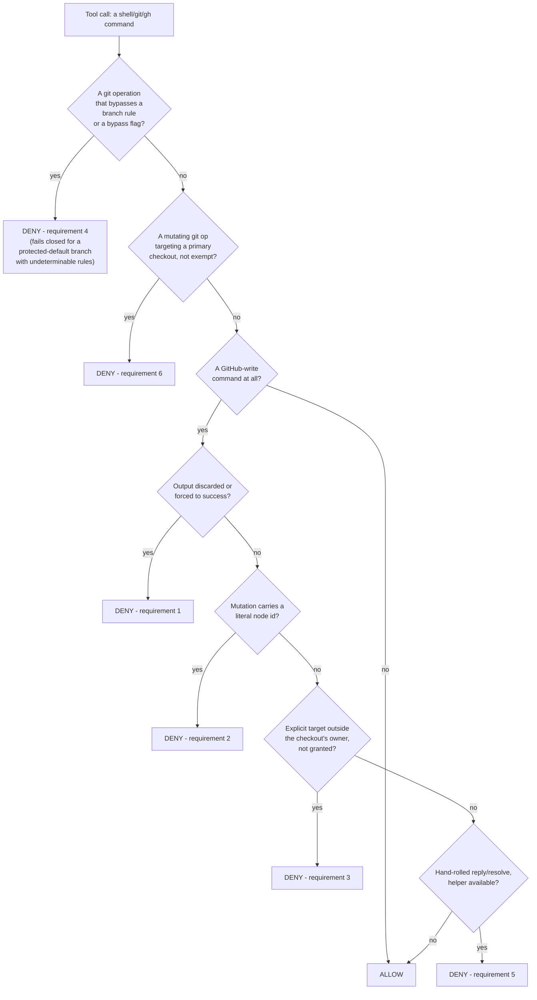
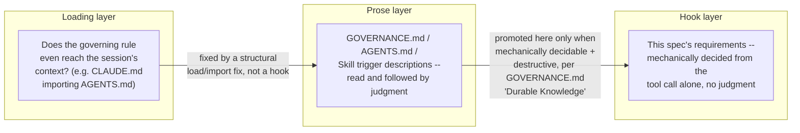

# Agent Write-Safety Spec

What any coding agent must be stopped from doing when it runs on this host with the maintainer's
`gh` credentials, stated once, independent of which agent implements it. This file is the source
of truth: an implementation is built from the requirements below, and an implementation is audited
by checking its decisions against them, not by reading its source as the implicit spec.

## Why This Exists

A mis-targeted GitHub write acts publicly under the maintainer's identity: a fabricated node id
once posted a stray comment, as the maintainer, to a stranger's repository. A mutating git command
run directly in a primary checkout destroys another task's uncommitted work without ever reaching
GitHub. Both incidents happened under prose rules the agent had already read. Neither was fixed by
writing the rule more clearly. [`GOVERNANCE.md`][governance] "Durable Knowledge and Self-Improvement"
states the general criteria for when a rule like this earns a mechanical hook instead of staying
prose. The requirements below are the write-safety instance of that criteria, applied.

## Requirements

Each requirement is stated as a decision rule, precise enough to implement against any agent's own
hook or approval-gate API, not tied to Claude Code's `PreToolUse` JSON shape.

1. **A GitHub write with its output discarded or forced to success is denied.** A state-changing
   `gh`/API call piped to `>/dev/null`, `2>/dev/null`, `&>/dev/null`, `|| true`, `|| :`, or `|| echo`
   hides the one signal that tells a client-reported failure apart from a server-side success. Deny
   the write, then allow it once run so its real result is read.
2. **A GraphQL mutation carrying a literal GitHub node id is denied.** Node ids resolve globally,
   so a fabricated, stale, or hand-typed id can land on a real object in a different repository. A
   literal id, such as one prefixed `PR_`, `PRRT_`, `IC_`, or `BOT_` (an uppercase-letter prefix
   followed by an underscore and a long body, or the legacy `MD`-prefixed base64 form), is denied. A
   `-F name="$VAR"` value in the same position is allowed instead of being pattern-matched, **not**
   because the hook has verified where `$VAR`'s value came from -- a static, pre-execution hook
   cannot see a shell variable's runtime binding, only the command text -- but because this rule's
   job is to catch the literal-id mistake specifically, and a captured-variable convention is what
   the fleet's own prose rule (`GOVERNANCE.md` "Repository Boundaries and Write Safety") requires
   agent behavior to uphold. Enforcing that the value genuinely came from a live query is
   behavioral, not something this decidable-from-text-alone rule can check.
3. **A GitHub write with an explicit target outside the checkout's own owner is denied, unless the
   maintainer granted it.** Compare the write's explicit `-R`/`--repo`/`repos/<owner>/<repo>` target
   against the checkout's own `origin` owner, when an `origin` resolves at all. A sibling repository
   under the same owner is allowed with no grant, since the harm this guards is reaching a
   stranger's repository, not working across one maintainer's own fleet. A different owner is
   allowed only when named in a grant read from the environment the session was launched with --
   never a channel the agent itself can set (an inline `VAR=x cmd` prefix or an `export` inside the
   same call must not satisfy this). **When no `origin` resolves at all** (a non-git directory, or a
   checkout whose remote can't be read), this requirement has nothing to compare the target against
   and does not fire -- requirements 1 and 2 still apply regardless, and this is the same
   precision-over-recall stance every requirement but 4 takes.
4. **A git operation that would only succeed by bypassing an active branch rule is denied**: a
   direct push to a branch whose rules require a pull request, a force-push where history is
   protected, a delete where deletion is blocked, or an explicit-bypass flag (`--admin` on a merge,
   `--no-verify` on a commit/push). Judge branch-rule cases against that branch's *live* rules, so a
   code-style `develop` denies and a config-style `develop` allows with no per-repo configuration.
   **This one fails closed, but only for a branch protected by default** (`main`, `master`,
   `develop`): when that branch's rules cannot be determined at all (network unreachable, origin
   unresolvable), deny rather than allow, because the harm is a silent success under the
   maintainer's own admin bypass. A push to any other branch whose rules cannot be determined
   passes this requirement instead, since there is nothing yet on record to bypass. Every other
   requirement here favors precision over recall throughout, denying only a positively-identified
   dangerous shape, since a hook that fails closed on an unrelated resolution failure blocks
   legitimate work far more often than it catches a real bypass.
5. **A hand-rolled reply or resolve on a review thread, bypassing the one-call helper, is denied
   (where a helper exists) unless the maintainer's cross-owner grant already covers it.** Splitting
   a reply and a resolve into two separate hand-run API calls is what let a reply sit unresolved
   across a push, reading as untriaged. Where the agent's fleet ships a single documented helper for
   this (this repo's `scripts/pr_review.py reply --resolve`), a raw mutation reaching the same
   endpoint is denied in favor of it. The one exception is a target the maintainer has already
   granted this session: the helper itself refuses a cross-owner pull request outright, so the
   hand-run form is then the documented fallback for that specific repository, and this is allowed
   through the same grant channel requirement 3 reads rather than a separate one. A REST reply's own
   URL can be checked against the grant. A `resolveReviewThread` mutation's thread id is opaque, so
   any active grant is the only signal available there, a coarser check than a REST reply gets and a
   residual gap this requirement accepts rather than blocking every grant-holding session's replies
   on an unrelated target.

6. **A mutating git operation run directly against a primary checkout is denied.** "Primary" means
   not a linked worktree. The decidable test is a comparison, not a filesystem-shape guess: `git
   rev-parse --path-format=absolute --git-dir --git-common-dir` returns equal paths for a primary
   checkout and unequal paths for a linked worktree. A `.git`-is-a-directory heuristic is wrong (a
   submodule's `.git` is a file yet is still a primary working tree that can lose uncommitted
   work). Deny `checkout`/`switch`/`pull`/`reset`/`rebase`/`merge`/`cherry-pick`/`revert`/`restore`/
   `stash` (anything but `list`/`show`)/`clean -f|-fd`/`add`/`commit`/`rm`/`apply`/`am`/`push`/
   `worktree remove -f|--force` there. `push` is denied unconditionally too, even though it does
   not mutate the local working tree or HEAD the way the rest of this list does: no documented
   fleet workflow ever pushes from a primary checkout, every push runs from a task's own worktree,
   and rule 4's own branch-rule checks already run before this rule and can deny a push on their
   own separate grounds regardless. A `checkout`/`switch` force flag
   (`-b`/`-B`/`-f`/`--force`/`--discard-changes`/`--orphan`) is recognized bundled into a
   short-option cluster or attached to `-b`/`-B`'s own value with no space (`-qf`, `-Bname`), not
   only as an exact argv token -- an exact-token check alone lets `-qf`/`-Bname` reach the ref-switch
   exemption below while still forcing the checkout through. Allow `worktree add|list|prune`, a
   plain `worktree remove` with no force flag, any read, `merge --ff-only`/`pull --ff-only` (git's
   own semantics mean neither can discard anything), a bare `-` as a `checkout`/`switch` argument
   (porcelain shorthand for the previous branch, which only those two subcommands themselves
   understand, so it is exempt outright rather than checked), and a `checkout <ref>`/`switch <ref>`
   carrying no force flag whose argument verifiably resolves as a ref -- checked live (`git rev-parse
   --verify --quiet <ref>^{commit}`), since git's own ref-switch path refuses to overwrite a local
   modification but its pathspec-restore fallback for an argument that does not resolve as a ref
   (`git checkout .`, `checkout -- <path>`, `checkout <ref> -- <path>`, more than one bare
   positional) carries no such check and is denied. A non-force flag alongside the ref, such as
   `--detach`/`-q`, stays exempt too -- verified live, it changes nothing about git's own
   overwrite-refusal, so this is a real-ref-with-no-force-flag test, not a strictly zero-flags one,
   despite reading as "flagless" at a glance. These exemptions are the normal, documented way an
   agent uses a primary checkout as a fetch source and returns it to a base branch afterward, and
   denying them adds no safety while breaking routine, correct work. The ref-checkout exemption is a
   deliberate, validated scope boundary worth naming explicitly: the incident behind this requirement
   (#1073) ran exactly this shape (an unforced `checkout` then an `--ff-only` pull), so this
   requirement does not deny that incident's own literal commands. The concurrent-access hazard those
   commands still carried either way -- switching HEAD or fast-forwarding a checkout another task
   might be relying on, whether or not the working tree was dirty -- is not decidable from the
   command text alone, so it stays the prose rule's job (`GOVERNANCE.md` "Repository Boundaries and
   Write Safety", `repo-worktree`), not this one's.

   A subcommand name this requirement does not otherwise recognize is resolved through a chain of
   git aliases before being allowed to fall through -- an inline `-c alias.<name>=<value>` override
   on the same invocation first, then the target checkout's own persisted config (`git config --get
   alias.<name>`), matching real git's own override order, up to a bounded number of hops -- so a
   custom alias that expands to a denied builtin (`git -c alias.wipe='reset --hard' wipe`, or the
   same `wipe` alias persisted in the checkout's own config) is denied exactly as the builtin itself
   would be. A `!`-prefixed alias hands git an arbitrary shell string rather than naming another git
   subcommand, and this requirement does not and cannot safely interpret one, so it denies that
   shape outright against a primary checkout, the one place this requirement departs from its own
   fail-open stance, because the alias definition itself is concrete evidence of an attempt to run
   something via git in exactly the directory this requirement protects.

   Resolve the target directory the way real git itself does, not by a last-option-wins scan across
   every directory-naming option: any `-C <dir>` options on the invocation compose sequentially (an
   absolute value replaces the running directory outright, a relative one joins onto the previous
   result) onto a leading `cd <dir> &&`/`cd <dir> ;` prefix on the same command -- read inside a
   `sh -c`/`bash -c` wrapper too, and inherited from an outer leading `cd` when a wrapped string
   carries none of its own -- or, absent one, the invocation's own working directory. An explicit
   `--work-tree`/`GIT_WORK_TREE=` value, when given anywhere on the invocation, then wins over that
   `-C`-chain result regardless of how many `-C` options preceded it, matching how `--work-tree`
   names the actual mutation target independent of where `-C` points, and a relative `--work-tree`
   value still resolves against the `-C` chain's own result. `--git-dir`/`GIT_DIR=` alone, with no
   `--work-tree`/`GIT_WORK_TREE=` anywhere on the same invocation, never relocates the target at all,
   matching git's own documented fallback -- `~`/`$HOME` is expanded throughout (a bare `$HOME` only
   when not immediately followed by another identifier character, so `$HOMEPATH`/`$HOMEDRIVE` are
   left alone rather than misread as a `$HOME` prefix), and a relative value is joined against the
   running result rather than wherever the hook process's own OS-level cwd happens to be. Fail open
   (allow) when no git repository resolves at all, matching this requirement's own
   precision-over-recall stance, not requirement 4's fail-closed one -- the harm here needs a
   positively-identified primary checkout to fire on. Granted only by
   `GH_WRITE_GUARD_ALLOW_PRIMARY_CHECKOUT`, read the same way `GH_WRITE_GUARD_ALLOW` is.

## Decision Flow

The first diagram is this spec's actual decision flow, generalized from `claude/gh-write-guard.py`'s
`classify()`. The second is why a failure lands in one layer and not another. A rule that never
reached the session at all is a loading bug, fixed the way PR #1081 fixed `local-strict-review`'s
missed trigger, by wiring `CLAUDE.md` to import `AGENTS.md`. A rule that reached the session and
was still not followed, where the trigger is mechanically decidable and the harm is destructive,
is promoted to a hook (requirement 6, above, tracked at [issue #1073][issue-1073], is the worked
example). A rule whose violation can only be judged, not mechanically decided (was a
review finding actually evidence-backed?), stays prose and a chained Skill trigger, since a hook
there could only nag, never decide.

## Per-Agent Status

| Agent | Status | Implementation |
| --- | --- | --- |
| Claude Code | All 6 requirements, via a `PreToolUse` hook | [`claude/README.md`][claude] |
| Codex | No hook yet -- tracked at [issue #781][issue-781] | [`codex/README.md`][codex] |
| opencode | No hook yet -- tracked at [issue #781][issue-781] | [`opencode/README.md`][opencode] |

GitHub Copilot carries no subdirectory here: it reviews through GitHub's own hosted infrastructure
rather than running local shell commands under the maintainer's credentials, so it has no analogous
local write-safety hazard for this kit to cover.

## Auditing an Implementation Against This Spec

Run the implementation's own self-test (`claude/gh-write-guard.py --selftest` for Claude Code) and
compare every case against the requirements list above, one by one, rather than reading the
implementation's source as though it were the spec. A case the self-test doesn't cover is a gap in
the audit, not evidence the requirement is satisfied. This is the concrete shape of "ask Claude to
audit the Claude hooks against the spec" or "ask Codex to implement Codex's own hooks against the
spec": point the agent at this file's requirements, not at another agent's source code.

<!-- Repo -->
[claude]: ./claude/README.md
[codex]: ./codex/README.md
[opencode]: ./opencode/README.md
[governance]: ../../GOVERNANCE.md
[issue-781]: https://github.com/ptr727/ProjectTemplate/issues/781
[issue-1073]: https://github.com/ptr727/ProjectTemplate/issues/1073
